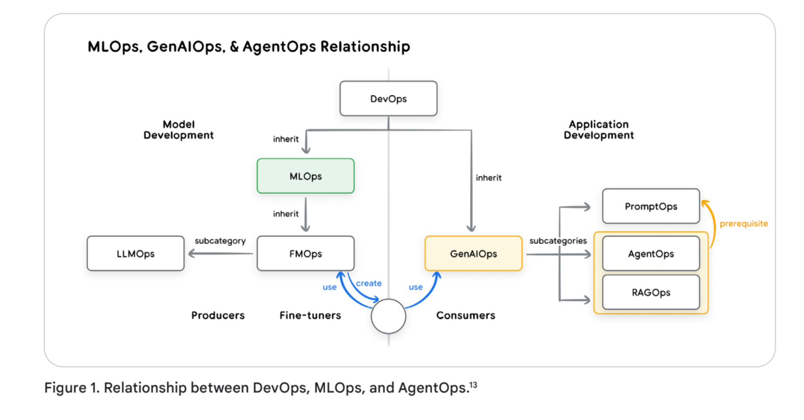
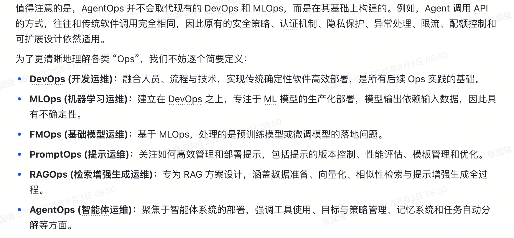
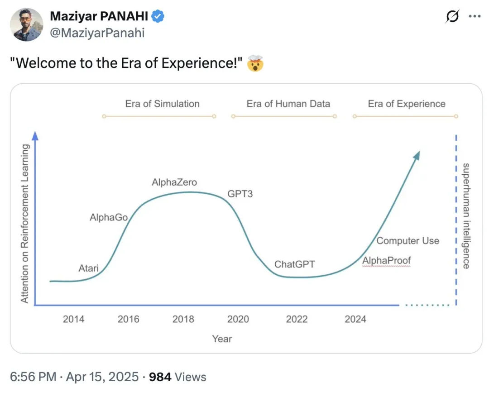

# 什么是Agent

现在的Agent智能体指的是生成式智能体，具体的定义是指为了实现特定的目标而设计的应用程序，它能够感知周围环境，并可以利用手头的工具采取有策略的行动。一个智能体通常有三部分来组成，构成了智能体的行为方式和决策机制。

1. 模型。可以是通用模型或者多模态模型，主要用于推理。
2. 工具。是智能体获取和处理外部真实数据的桥梁。
3. 编排层。主要负责智能体整合信息、记忆、状态，并进行内部推理，并据此决定下一步的行动。常见的推理包括ReAct、CoT等。

Anthopic的定义：是模型给予环境的反馈去使用工具的程序。

Content：指的的LLM在执行任务时各种信息的总和。

[agents companion](https://www.kaggle.com/whitepaper-agent-companion)

## 工具调用（Tool Use）的相关方案

- Function Call
Function Call 最早由 OpenAI 提出，能够让大模型通过调用外部函数实现 Tool Use。但是因为不同系统的调用标准都不太一样，就好比 +86 的手机号在美国就没法接打电话一样，很可能你到了另外一个国家，就得把所有东西都重做一遍，所以它不太通用。

- MCP
为了解决这个问题，就有了 MCP。MCP 的核心价值在于「统一了 Tool Use 的度量衡」，极大地降低了这件事的门槛。它可以把任务拆解成多个子任务，而每个子任务都有模块化、有统一标准的组件。通过这种方式，最后大家就能更加自由地调用各种工具。

- A2A
至于 Google 最近推出的 A2A，我认为它并没有提供新的技术解决方案，更像是一个大厂为了争夺 Tool Use 话语权而强行推出的 KPI 工程，然后找了一堆合作伙伴来推广。

A2A 号称自己和 MCP 的区别在于，MCP 只能让 Agent 通过函数接口去调用外部工具或者 API，而 A2A 却可以实现 Agent 之间的交互。但其实这两种交互方式并没有本质区别，因为 Agent 本身也有函数调用的接口，所以 MCP 也能间接实现 Agent 之间的交互。

- Computer User & Browser Use
Computer Use 和 Browser Use 指的是让大模型把电脑和浏览器作为工具来调用。浏览器可能是大模型目前能调用的最重要的工具之一。

# 经验时代

[Welcome to the Era of Experience](https://storage.googleapis.com/deepmind-media/Era-of-Experience%20/The%20Era%20of%20Experience%20Paper.pdf)

[超人智能靠经验](https://mp.weixin.qq.com/s/Rl-YUOIMxmpw_Ca6vf2YxA)

人工智能主要分为3个时代：

模仿时代：Atari、Alphago、AlphagoZero
人类数据时代：GPT3、chatGPT
经验时代：Alphaproof、Computer Use

