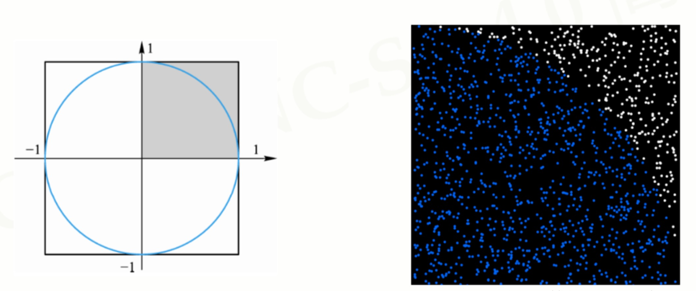
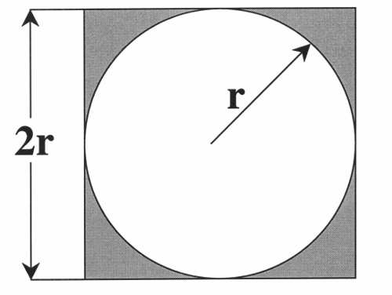
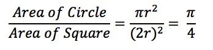
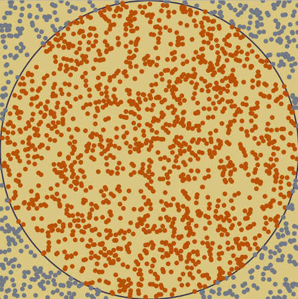

[TOC]

# 蒙特卡罗

蒙特卡罗方法是一种计算方法。原理是通过大量随机样本，去了解一个系统，进而得到所要计算的值。它诞生于上个世纪40年代美国的"曼哈顿计划"，名字来源于赌城蒙特卡罗，象征概率。


##  蒙特卡洛模拟

### 实例一(模拟PI值)

#### 原理

> 单位圆的面积是PI，单位圆的外切正方形面积是4. 所以，1/4个圆的面积是PI/4，外切正方形的面积是1. 而1/4圆的面积/单位正方形的面积就是PI/4









#### python实现

```python
"""
使用蒙特卡罗方法计算PI值
"""

import random
import math
import time

# 调用一次perf_counter()，从计算机系统里随机选一个时间点A，计算其距离当前时间点B1有多少秒。当第二次调用该函数时，
# 默认从第一次调用的时间点A算起，距离当前时间点B2有多少秒。两个函数取差，即实现从时间点B1到B2的计时功能。
start_time = time.perf_counter()

total = 10000 * 10000
hits = 0

for c in range(total):
    x = random.random()
    y = random.random()

    if math.sqrt(x**2 + y**2) <= 1:
        hits += 1

PI = 4 * (hits/total)

print("PI=", PI)

end_time = time.perf_counter()

print("COST {:.2f}S".format(end_time - start_time))


"""
result:
PI= 3.14158952
COST 52.55S
"""

```


## MCTS 蒙特卡洛树搜索


# 最有潜力的下一步行动 --> minimax策略和alpha-beta剪枝算法

## 极小极大算法弱点

> 需要展开整个博弈树，对于有高分支因子的博弈将会产生巨大的博弈树，使计算无法进行

## 解决办法

### 在确定的阀值深度d内展开博弈树

> 但是我们无法保证在阈值深度 d 处的任何节点是否端节点。因此我们一个函数来评估非终端博弈状态。这对于人类来说很自然：即使博弈仍在进行，你也可能通过
观察围棋或国际象棋的棋盘预测胜者

### alpha-beta 剪枝

> 通过alpha-beta剪枝算法来修剪博弈树。alpha-beta 剪枝是提升版的极小极大算法，它以极小极大算法的形式遍历博弈树，并避免某些树分支的展开，其得到
的结果在最好的情况下等于极小极大算法的结果。alpha-beta 剪枝通过压缩搜索空间提高搜索效率。


https://blog.csdn.net/ljyt2/article/details/78332802?locationNum=9&fps=1 （蒙特卡洛树搜索（MCTS）算法）

https://cloud.tencent.com/developer/article/1150410 （mcts最新成果）

https://www.jiqizhixin.com/articles/monte-carlo-tree-search-beginners-guide （）


# reference

[MCTS初探](https://www.cnblogs.com/yifdu25/p/8303462.html)


