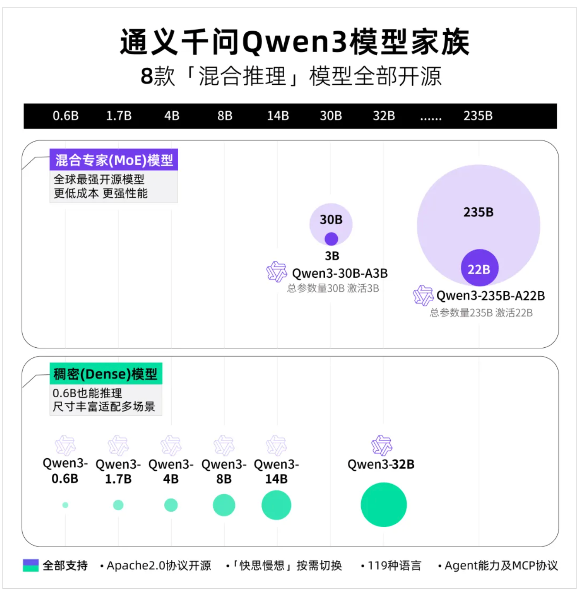
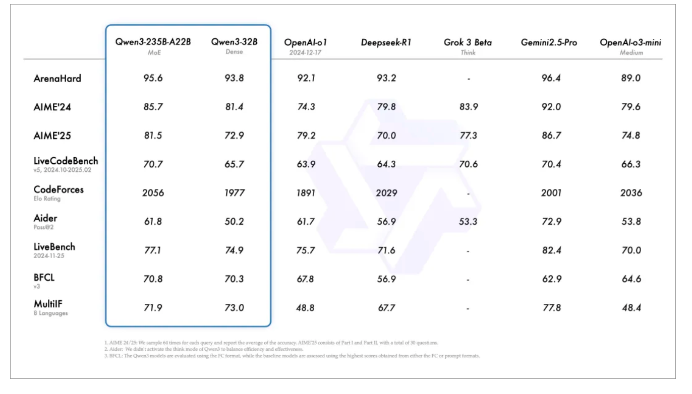
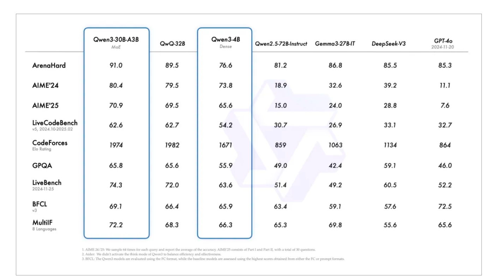

# LLM部署

1. VLM的优势：适合大批量prompt输入，并对推理速度有较高要求的场景。

2. 启动

```python
python -m vllm.entrypoints.openai.api_server --help

# 启动
CUDA_VISIBLE_DEVICES=0 python -m vllm.entrypoints.openai.api_serve --trust-remote-code
 --served-model-name qwen2-7b-test --model /data/qwen/Qwen/Qwen2___5-7B-Instruct --tensor-parallel-size 1 --port 9010 --max_model_len 20000 --gpu-memory-utilization 0.92
# 简单测试
curl http://127.0.0.1:9010/v1/chat/completions \
-H "Content-Type: application/json" \
-d '{"messages": [
{"role": "system", "content": "You are a helpful assistant."},
{"role": "user", "content": "百度是一家公司，请详细介绍下它的基本情况"}]
}'

# 程序测试
from openai import OpenAI
# Set OpenAI's API key and API base to use vLLM's API server.
openai_api_key = "EMPTY"
openai_api_base = "http://localhost:8000/v1"

client = OpenAI(
    api_key=openai_api_key,
    base_url=openai_api_base,
)

chat_response = client.chat.completions.create(
    model="llama3_8b_instruct",
    messages=[
        {"role": "system", "content": "You are a helpful assistant."},
        {"role": "user", "content": "Tell me a joke."},
    ]
)
print("Chat response:", chat_response)


import requests
import json

def send_message_to_vllm(message, host_port="http://localhost:8000"):
    url = f"{host_port}/v1/chat/completions"
    payload = {
        "model": "/app/models/qwen/Qwen1.5-0.5B-Chat",
        "messages": [{"role": "user", "content": message}]
    }
    response = requests.post(url, json=payload)
    if response.status_code == 200:
        response_content = ""
        for line in response.iter_lines():
            if line:
                response_content += json.loads(line)["choices"][0]["message"]["content"]
        return response_content
    else:
        return f"Error: {response.status_code} - {response.text}"

user_input = "介绍一下北京的旅游景点?"
send_message_to_vllm(user_input)
```

# Qwen3

https://modelscope.cn/collections/Qwen3-9743180bdc6b48

https://huggingface.co/collections/Qwen/qwen3-67dd247413f0e2e4f653967f

https://github.com/QwenLM/Qwen3



- Qwen3 模型支持两种思考模式：

1. 思考模式：在这种模式下，模型会逐步推理，经过深思熟虑后给出最终答案。这种方法非常适合需要深入思考的复杂问题。

2. 非思考模式：在此模式中，模型提供快速、近乎即时的响应，适用于那些对速度要求高于深度的简单问题。

- 多语言特性：支持119种语言

- 增强Agent能力

## 


##  Qwen3-235B-A22B

- 在代码、数学、通用能力等基准测试中，与一众顶级模型相比，表现出极具竞争力的结果。



## Qwen3-30B-A3B

- 激活参数数量是QwQ-32B10%，表现更胜一筹， Qwen3-4B 这样的小模型也能匹敌 Qwen2.5-72B-Instruct 的性能。




