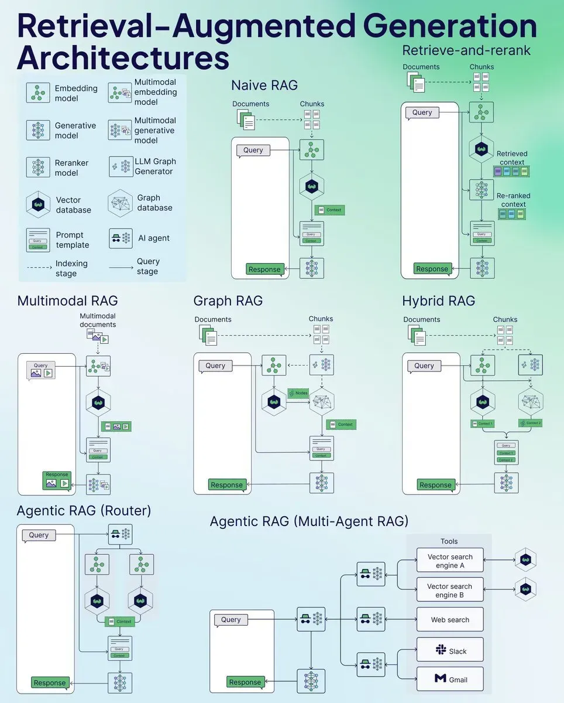

# Prompt工程

# 微调

# 对齐

# CoT

# 推理
强化学习推理模型：DeepSeek-R1、OpenAI o1/o3。

# 多模态

# 蒸馏

# 基于大模型的表格类型特征处理

# 基于大模型的推荐

# 数据合成

# 数据增强

# 强化学习

# 智能体

## 核心问题

1. AI-Agent如何通过经验调整行为。

- 反思能力

- RAG能力

2. AI-Agent如何使用工具。

- 搜索引擎

- 写python代码

- 其它AI-Agent

3. AI-Agent能不能做计划。

- 推理能力

- 

https://arxiv.org/pdf/2504.01990

大家通过 Operator、Manus 等产品看到了「人机协作」在任务处理时的工作示范——智能体负责任务规划和操作电脑浏览器执行任务，人类负责接管登录等极少数工作。
乍看之下，人机协作在软件技术方案上已经初具雏形，但在企业的具体业务场景下，还有几个核心要点存在争议：
具体的企业业务流程会在以下两种极端情况之间的权衡，协作的必要性和信任的建立需要科学的可解释性支撑：
不接管，智能体可能会采用次优的、甚至可能存在危险的策略；
接管多，人类就会对智能体失去信心，从而极大地限制其效用。
在由人类衔接的业务流程中，不同的组织环境和专业领域对协作的有效性存在较大影响，那智能体如何与人类构成有效的协作？

在此背景下，分享两篇论文：
论文1地址：https://arxiv.org/html/2504.04592v2
核心观点：
人机信任与干预平衡： 研究提出了一种“终止者”模型，允许人类在 AI 行为不确定或不可信时介入操作。
可解释性策略： 通过策略摘要和轨迹示例，帮助人类理解 AI 的行为模式，从而优化干预时机。
强化学习背景下的协作： 聚焦于如何在复杂状态空间中，使人类更有效地预测和理解 AI 的决策过程。
论文2地址：https://arxiv.org/pdf/2504.20903
核心观点：
任务结构对协作模式的影响： 通过 NK 模型模拟，分析在模块化（并行）与序列化（依赖性强）任务中，人机协作的最优策略。
人机角色互补性： 发现在人类先行、AI 后续优化的序列化任务中，协作效果最佳；而在模块化任务中，AI 更可能替代人类。
AI 的独立代理性： 强调 AI 不仅是辅助工具，更是具备自主决策能力的战略参与者，需重新评估其在组织决策中的角色。

# RAG

## RAG的范式

1. Native RAG：基础检索RAG
2. Advanced RAG：
3. Modular RAG：具有反思模块的RAG

## RAG面临的核心问题

### 多模态与复杂任务扩展

1. 多模态支持不足：当前的RAG主要针对于文本数据，对于图像、视频等多模态数据仍然存在挑战。往往这部分数据构成了企业中大多数的数据。
2. 复杂推理任务：RAG虽然解决了通过检索外部知识增强了模型的推理能力，但在多跳推理或者复杂逻辑任务时，其性能仍有待提升。

### 检索质量和噪声问题

1. 检索精度不足：RAG的性能依赖于检索到的文档质量，文档质量差或者噪声较多会导致检索错误。
2. Semantic GAP（语义鸿沟）：在query和context之间往往会因为缺乏明确意图或者“多跳”问题，需要从多个子问题综合而来，这种情况下会存在语义鸿沟。

### 生成过程存在幻觉和冗余

1. 幻觉问题：当检索到的外部信息不全或者有较大噪声时，模型依然会生成虚构或者不准确的问题。
2. 冗余&重复：当检索到的内容包含相似信息时，生成内容可能出现冗余和重复。

### 计算资源与效率问题

1. 资源：向量数据库的存储、增加检索步骤等都会导致比传统的LLM更长。
2. 效率：知识的更新需要更加实时性。

### 安全&隐私问题

### 奖励函数与训练机制优化

1. 奖励函数设计：当前的RAG系统通常采用基于结果的奖励函数，但在复杂的场景中，这种设计可能无法捕捉到细微的差距。
2. 训练数据依赖：需要高质量的交互数据，但获取和标准这部分数据的成本是高昂且费时的。

[RAG 2.0 深入解读](https://mp.weixin.qq.com/s/pe9r6OSCI6l5ocUw1LHmMw)

# 应用

Agent

在当今竞争激烈的汽车市场中，制定有效的区域销售策略至关重要。利用算法把市场竞争建模为一个非合作博弈问题是常见做法，汽车企业可以依此更好地优化区域销售策略，提高市场竞争力，实现销售的智能化和科学化。

下面这篇论文把电力辅助服务市场建模为一个多领导者-单追随者的双层博弈问题，使用以下算法方案求解：
集成优化方法：利用市场的潜在结构来求解均衡。
高斯-塞德尔最佳响应方法：通过迭代求解每个生产者的最优策略。
多智能体深度强化学习（MARL）：通过模拟市场环境，让智能体（生产者）通过学习来优化其投标策略。
作者使用德国和奥地利的真实数据进行模拟，涵盖了2024年1月至8月的辅助服务市场数据，进行实验后得到以下结论：
MARL 算法的有效性：MARL 算法在模拟市场环境方面表现出色，能够快速评估市场数据，尽管需要预训练。
市场成本与公平性的权衡：MARL 算法虽然能够降低市场成本，但会导致利润分配的不平等。
区域间耦合的经济影响：更强的区域间耦合可以降低较大区域的市场成本，这与文献中的其他分析结果一致。
论文链接：https://arxiv.org/html/2505.03288v1

借鉴论文思路，我们其实可以尝试将区域销售团队和竞争品牌视作多智能体，在中央平台协调下，共同博弈优化区域销售策略：
模型映射
智能体（Leader）：本品牌在各区域或经销商，独立决定定价、促销、库存调拨等策略。
中央平台（Follower）：汇总各区域和竞品策略，进行资源分配（广告预算、跨区调拨），确保整体约束。
竞品团队：视为其他领导者，同时参与市场博弈。
状态、动作与奖励
状态：包括本区和邻区需求、库存水平、竞品价格和促销力度，以及宏观经济或季节性指标。
动作：价格折扣率、广告投放预算、促销活动强度、跨区库存调拨量等。
奖励：区域净利润＋市场份额提升－库存或折扣成本，用权重平衡短期收益和长期增长。
博弈与均衡
将问题建模为“多领导者–单追随者”的广义纳什博弈，各区域策略相互影响，中央平台资源共享约束。
理论上可借助潜在博弈或 KKT 条件分析均衡存在性，为算法收敛提供保障。
流程
 数据与仿真：搭建数字孪生市场，模拟需求响应和竞品反应；
 智能体定义：按区域或经销商划分，设计状态与动作空间；
 奖励设计：平衡利润、市场份额和风险；
 算法训练：引入竞品策略做对抗训练，监控收敛和稳定性；
 测试迭代：在线下 A/B 测试对比传统方案，逐步在真实系统中部署并持续优化。
通过这套框架，既能让各区域团队自主优化，又能在中央层面协调资源，实现品牌整体收益最大化。

# 资源

课程：吴恩达《面向开发者的LLM课程》、斯坦福CS324《大模型》

书籍：《大规模语言模型：从理论到实践》《ChatGPT原理与实战》

社区：Hugging Face、AI技术论坛（如arXiv、Papers with Code）

