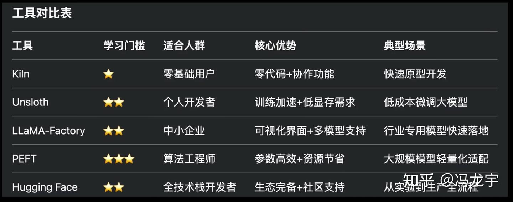
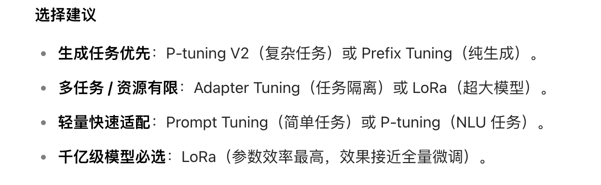

# LLaMA-Factory



```bash
# https://llamafactory.readthedocs.io/zh-cn/latest/getting_started/installation.html
# 环境安装
git clone --depth 1 https://github.com/hiyouga/LLaMA-Factory.git
cd LLaMA-Factory
pip install -e ".[torch,metrics]"

llamafactory-cli version
```


ssc_summary_bussiness_and_rag


# 微调模型思路

Prompt tunnig
Adaper tuning
Prefix tuning
P-tuning
P-tuning V2
LoRa



[LLM微调方法(Efficient-Tuning)六大主流方法](https://www.cnblogs.com/ting1/p/18252685)

[大模型 finetune 的几种方法和对应框架](https://note.iawen.com/note/llm/finetune)


