# 大语言发展简史

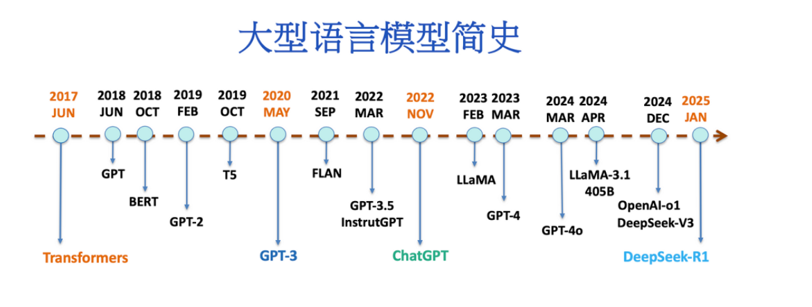

## 语言模型
- 自回归语言模型 （Autoregressive Language Models）
大多数LLMs以「自回归方式」(Autoregressive)操作，这意味着它们根据前面的「文本」预测下一个「字」（或token／sub-word）的「概率分布」(propability distribution)。这种自回归特性使模型能够学习复杂的语言模式和依赖关系，从而善于「文本生成」。

在文本生成任时，LLM通过解码算法(Decoding Algorithm)来确定下一个输出的字。

这一过程可以采用不同的策略：既可以选择概率最高的下个字（即贪婪搜索），也可以从预测的概率分布中随机采样一个字。后一种方法使得每次生成的文本都可能有所不同，这种特性与人类语言的多样性和随机性颇为相似。
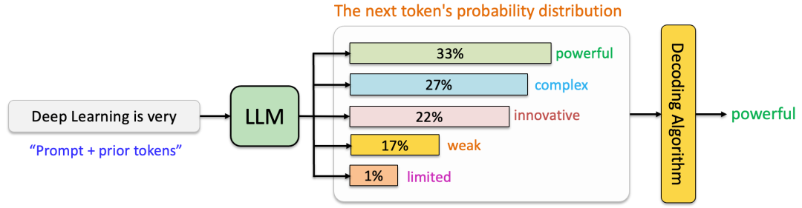

## Transformer革命 (2017)
Vaswani等人在2017年通过其开创性论文“Attention is All You Need”引入了Transformer架构，标志着NLP的一个分水岭时刻。它解决了早期模型如循环神经网络（RNNs）和长短期记忆网络（LSTMs）的关键限制，这些模型在长程依赖性和顺序处理方面存在困难。

这些问题使得使用RNN或LSTM实现有效的语言模型变得困难，因为它们计算效率低下且容易出现梯度消失等问题。另一方面，Transformers克服了这些障碍，彻底改变了这一领域，并为现代大型语言模型奠定了基础。

## 预训练Transformer模型时代 (2018–2020)
- BERT：双向上下文理解 (2018)

2018年，谷歌推出了BERT（Bidirectional Encoder Representations from Transformers），这是一种使用Transformer编码器(Encoder)的突破性模型，在广泛的NLP任务中取得了最先进的性能。

与之前单向处理文本（从左到右或从右到左）的模型不同，BERT采用了双向训练方法，使其能够同时从两个方向捕获上下文。通过生成深层次的、上下文丰富的文本表示，BERT在文本分类、命名实体识别（NER）、情感分析等语言理解任务中表现出色。

- GPT：生成式预训练和自回归文本生成（2018–2020）
虽然BERT优先考虑双向上下文理解，但OpenAI的GPT系列采用了不同的策略，专注于通过自回归预训练实现生成能力。通过利用Transformer的解码器(Decoder)，GPT模型在自回归语言模型和文本生成方面表现出色。
GPT (2018)GPT的第一个版本于2018年发布，是一个大规模的Transformer模型，经过训练以预测序列中的下一个词，类似于传统语言模型。

单向自回归训练：GPT使用因果语言建模目标进行训练，其中模型仅基于前面的标记预测下一个标记。这使得它特别适合于生成任务，如文本补全、摘要生成和对话生成。
下游任务的微调：GPT的一个关键贡献是它能够在不需要特定任务架构的情况下针对特定下游任务进行微调。只需添加一个分类头或修改输入格式，GPT就可以适应诸如情感分析、机器翻译和问答等任务。

- GPT-2 (2019)在原版GPT的成功基础上，OpenAI发布了GPT-2，这是一个参数量达15亿的更大模型。GPT-2展示了令人印象深刻的零样本(Zero-shot)能力，意味着它可以在没有任何特定任务微调的情况下执行任务。例如，它可以生成连贯的文章、回答问题，甚至在语言之间翻译文本，尽管没有明确针对这些任务进行训练。

- GPT-3 (2020)GPT-3的发布标志着语言模型规模扩展的一个转折点。凭借惊人的1750亿参数(175B parameters)，GPT-3突破了大规模预训练的可能性界限。它展示了显著的少样本(Few-short)和零样本(Zero-short)学习能力，在推理时只需提供最少或无需示例即可执行任务。GPT-3的生成能力扩展到了创意写作、编程和复杂推理任务，展示了超大模型的潜力。

## ChatGPT：推进对话式AI (2022)

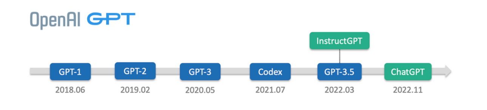

2022年3月，OpenAI推出了GPT-3.5，这是GPT-3的升级版，架构相同但训练和微调有所改进。关键增强包括通过改进数据更好地遵循指令，减少了幻觉（尽管未完全消除），以及更多样化、更新的数据集，以生成更相关、上下文感知的响应。
ChatGPT基于GPT-3.5和InstructGPT，OpenAI于2022年11月推出了ChatGPT，这是一种突破性的对话式AI模型，专门为自然的多轮对话进行了微调。ChatGPT的关键改进包括：
（1）对话聚焦的微调：在大量对话数据集上进行训练，ChatGPT擅长维持对话的上下文和连贯性。
（2）RLHF：通过整合RLHF，ChatGPT学会了生成不仅有用而且诚实和无害的响应。人类培训师根据质量对响应进行排名，使模型能够逐步改进其表现。

## 多模态模型（文本、图像及其他2023-2024）

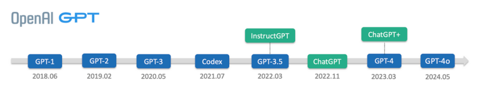
在2023-2024年，多模态大语言模型将文本、视频、音频、图像整合到统一系统，重新定义了AI。

（1）GPT-4V：语言与视觉相结合，它可以解释图像、生成标题、回答视觉问题、推断视觉上下文关系。其跨模态的注意力机制允许文本和图像数据的无缝集成。
（2）GPT-4o：全模态前沿。
2024年初，GPT-4o通过整合音频和视频输入进一步推进了多模态。

## 开源和开放权重模型 (2023–2024)
在2023年至2024年间，开源和开放权重AI模型获得了动力。
（1）开放权重LLMs：开放权重模型提供公开访问的模型权重，限制极少。这使得微调和适应成为可能，但架构和训练数据保持封闭。它们适合快速部署。
（2）开源模型使底层代码和结构公开可用。这允许全面理解、修改和定制模型，促进创新和适应性。
（3）社区驱动的创新：像Hugging Face这样的平台促进了协作，LoRA和PEFT等工具使高效的微调成为可能。

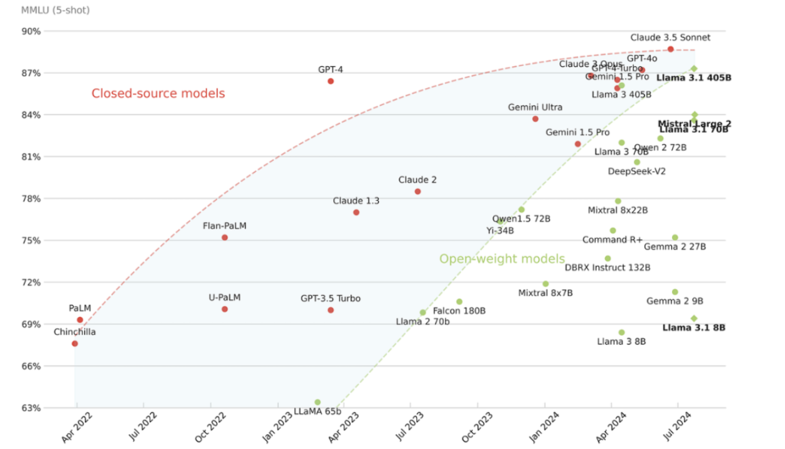
LLaMA3.1–405B模型首次历史性地弥合了与闭源对应物的差距。

## 推理模型：从「系统1」到「系统2」思维的转变 (2024)

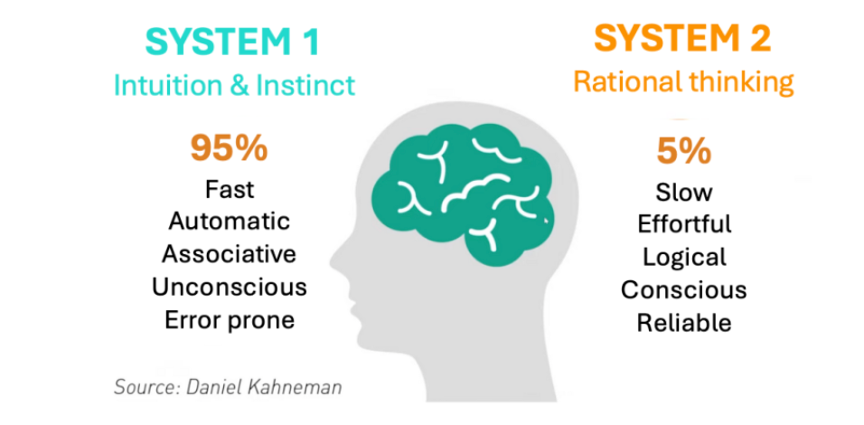
2024年，AI开发开始强调增强「推理」(Reasoning)，从简单的模式识别转向更逻辑化和结构化的思维过程。这一转变受到认知心理学双重过程理论的影响，区分了「系统1」（快速、直觉）和「系统2」（缓慢、分析）思维。虽然像GPT-3和GPT-4这样的早期模型在生成文本等「系统1」任务上表现出色，但在深度推理和问题解决方面却有所欠缺。

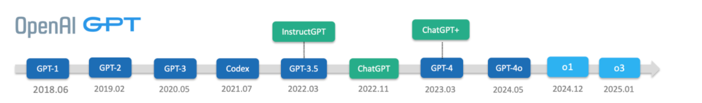
2024年9月12日，OpenAI发布的o1-preview标志着人工智能能力的重大飞跃，尤其是在解决复杂推理任务（如数学和编程）方面。与传统LLMs不同，推理模型采用了「长链思维」（Long CoT） — — 即内部的推理轨迹，使模型能够通过分解问题、批判自己的解决方案并探索替代方案来“思考”问题。这些CoTs对用户是隐藏的，用户看到的是一个总结性的输出。
（1）Open AI-o1
- 长链思维（Long CoT） ：使模型能够将复杂问题分解为更小的部分，批判性地评估其解决方案，并探索多种方法，类似于搜索算法。
- 推理时计算控制 ：对于更复杂的问题，可以生成更长的CoTs；而对于较简单的问题，则使用较短的CoTs以节省计算资源。
- 增强的推理能力 ：尽管像o1-preview这样的初始推理模型在某些领域的能力不如标准LLMs，但在推理任务中，它们的表现远远超越了后者，常常能与人类专家媲美。例如，o1-preview在数学（AIME 2024）、编程（CodeForces）和博士级别的科学问题上均超越了GPT-4o。
2024年12月5日，OpenAI的完整版o1模型进一步提升了性能，在美国AIME 2024数学考试中排名前500名学生之列，并显著超越了GPT-4o（解决了74%-93%的AIME问题，而GPT-4o仅为12%）。此外，o1-mini作为更便宜且更快的版本，在编码任务中表现出色，尽管其成本仅为完整版o1的20%。

（2）Open AI-o3
2025年1月31日，OpenAI发布了o3，这是其推理模型系列的最新突破，建立在o1模型成功的基础之上。尽管完整的o3模型尚未发布，但其在关键基准测试中的表现被描述为具有开创性。

- ARC-AGI ：达到87.5%的准确率，超过了人类水平的85%，远超GPT-4o的5%。
- 编程 ：在SWE-Bench Verified上得分71.7%，并在Codeforces上获得2727的Elo评分，跻身全球前200名竞争性程序员之列。
- 数学 ：在EpochAI的FrontierMath基准测试中达到25.2%的准确率，相比之前的最先进水平（2.0%）有了显著提升。

## 成本高效的推理模型：DeepSeek-R1 (2025)
（1）DeepSeek-V3 (2024–12)
该模型最多包含6710亿个参数，其中370亿个活跃参数，并采用专家混合（MoE）架构，将模型划分为专门处理数学和编码等任务的组件，以减轻训练负担。该模型引入了三个关键架构：
- 多头潜在注意力（Multi-head Latent Attention — MLA）：通过压缩注意力键和值来减少内存使用，同时保持性能，并通过旋转位置嵌入（RoPE）增强位置信息。
- DeepSeek专家混合（DeepSeekMoE）：在前馈网络（FFNs）中采用共享和路由专家的混合，以提高效率并平衡专家利用率。
- 多标记预测 (Multi-Token Prediction — MTP)：增强模型生成连贯且上下文相关的输出的能力，特别是对于需要复杂序列生成的任务。

（2）DeepSeek-R1-Zero 和 DeepSeek-R1 (2025–01)
利用先进的强化学习技术，这些模型证明了高性能推理可以在没有通常与尖端AI相关的巨额计算费用的情况下实现。这一突破巩固了DeepSeek作为高效和可扩展AI创新领导者的地位。

- DeepSeek-R1-Zero：一种基于DeepSeek-V3的推理模型，通过强化学习（RL）增强其推理能力。它完全消除了「监督微调」(SFT)阶段，直接从名为DeepSeek-V3-Base的预训练模型开始。

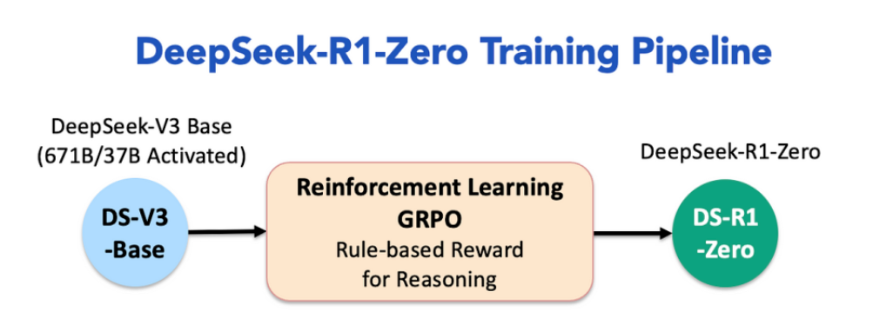
它采用了一种基于「规则的强化学习方法」(Rule-based Reinforcement Learning)，称为「组相对策略优化」（Group Relative Policy Optimization — GRPO），根据预定义规则计算奖励，使训练过程更简单且更具可扩展性。

- DeepSeek-R1：为了解决DeepSeek-R1-Zero的局限性，如低可读性和语言混杂，DeepSeek-R1纳入了一组有限的高质量冷启动数据和额外的RL训练。该模型经历了多个微调和RL阶段，包括拒绝采样和第二轮RL训练，以提高其通用能力和与人类偏好的一致性。
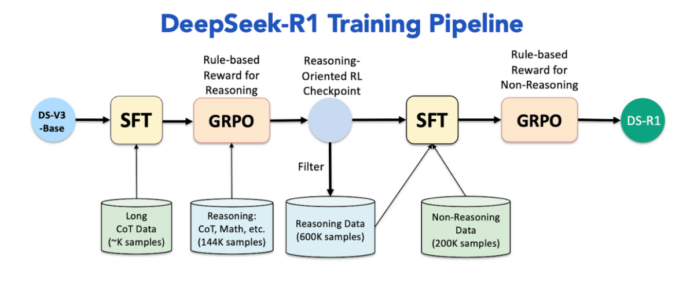

- 蒸馏DeepSeek模型：DeepSeek开发了较小的、蒸馏版的DeepSeek-R1，参数范围从15亿到700亿，将先进的推理能力带到较弱的硬件上。这些模型使用原始DeepSeek-R1生成的合成数据进行微调，确保在推理任务中表现出色，同时足够轻量化以便本地部署。
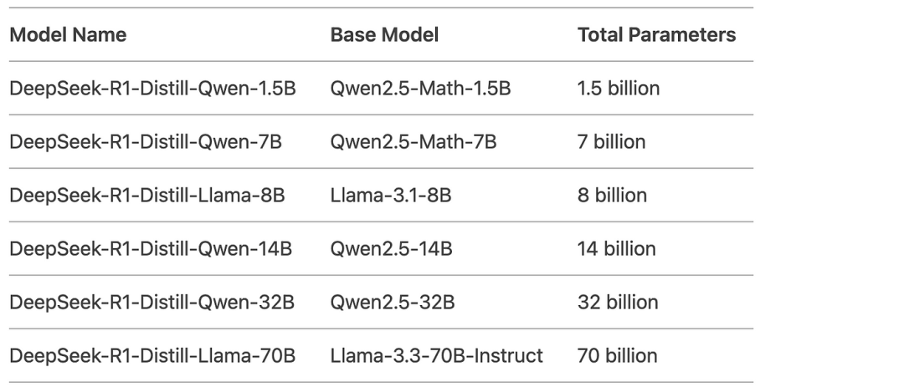

## 结论
从2017年Transformer架构的引入到2025年DeepSeek-R1的发展，大型语言模型（LLMs）的演变标志着人工智能领域的一个革命性篇章。LLMs的崛起由四个里程碑式的成就标示：

（1）Transformers (2017)：Transformer架构的引入为构建能够以前所未有的精确性和灵活性处理复杂任务的大规模高效模型奠定了基础。

（2）GPT-3 (2020)：该模型展示了规模在AI中的变革力量，证明了在大规模数据集上训练的巨大模型可以在广泛的应用中实现接近人类的表现，为AI所能完成的任务设立了新的基准。

（3）ChatGPT (2022)：通过将对话式AI带入主流，ChatGPT使高级AI对普通用户来说更加可访问和互动。它还引发了关于广泛采用AI的伦理和社会影响的关键讨论。

（4）DeepSeek-R1 (2025)：代表了成本效率的一大飞跃，DeepSeek-R1利用专家混合架构(MoE)和优化算法，与许多美国模型相比，运营成本降低了多达50倍。其开源性质加速尖端AI应用的普及化，赋予各行业创新者权力，并强调了可扩展性、对齐性和可访问性在塑造AI未来中的重要性。

# 大语言模型存在问题

## 后训练对齐：弥合AI和人类价值观之间的差距
幻觉问题，「幻觉」即LLM生成与事实不符、无意义、或者与输入矛盾的内容，给人一种一本正经的胡说八道的印象。

### 监督微调（SFT）
SFT类似于指令调优，通过高质量的数据输入-输出或者演示上训练模型，以教会它如何遵循指令并生成所需要的输出。

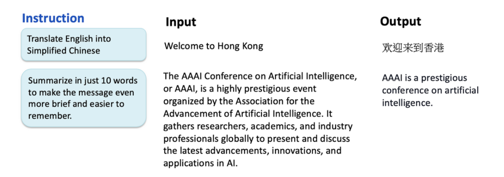

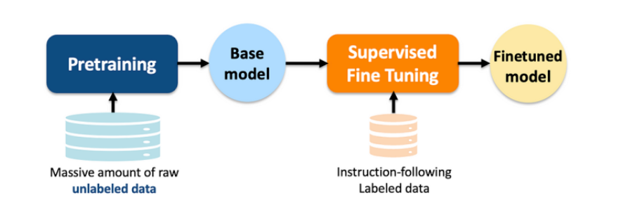

SFT的局限性：
（1）可扩展性：收集高质量的数据比较耗时，尤其对于复杂或者小众的任务。
（2）性能：简单模型人类行为，并不能保证模型的性能能够超越人类。或者在未见过的任务上具有更好的泛化。

### 基于人类反馈的强化学习（RLHF）
Open AI在2022年引入RLHF解决了SFT的扩展性和性能限制。RLHF包含两个关键的步骤：
（1）训练奖励模型：人类注释者对模型生成的多个输出进行排名，创建一个偏好数据集。使用这些数据训练一个奖励模型，该模型学习根据人类的反馈评估输出的质量。
（2）使用强化学习微调LLM：奖励模型使用近端优化策略（PPO）指导LLM微调。通过迭代更新，模型可以学习到更符合人类偏好和期望的输出。

