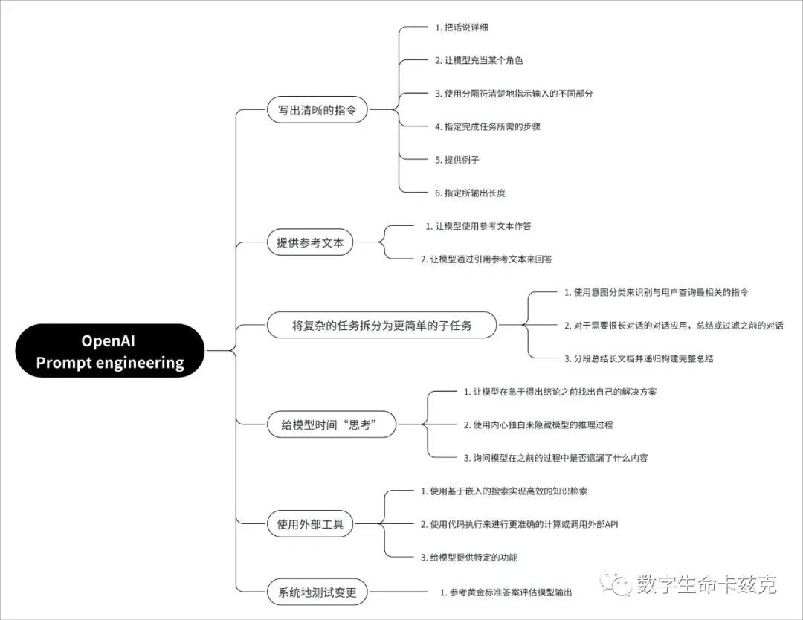

# 写好prompt的指南

1. 写出清晰的指令。
（1）把话说详细。
（2）让模型充当某个角色。
（3）使用分隔符清楚地指示输入的不同部分。
（4）指定完成任务所需的步骤。
（5）提供例子。
（6）指定所输出长度。

2. 提供参考文本。
（1）让模型使用参考文本作答
（2）让模型通过引用参考文本来回答

3. 将复杂的任务拆分为更简单的子任务
（1）使用意图分类来识别与用户查询最相关的指令
（2）对于需要很长对话的对话应用，总结或过滤之前的对话
（3）分段总结长文档并递归构建完整总结

4. 给模型时间「思考」
（1）让模型在急于得出结论之前找出自己的解决方案
（2）询问模型在之前的过程中是否遗漏了什么内容

5. 使用外部工具
（1）使用基于嵌入的搜索实现高效的知识检索
（2）使用代码执行来进行更准确的计算或调用外部API
（3）给模型提供特定的功能

6. 系统地测试变更

