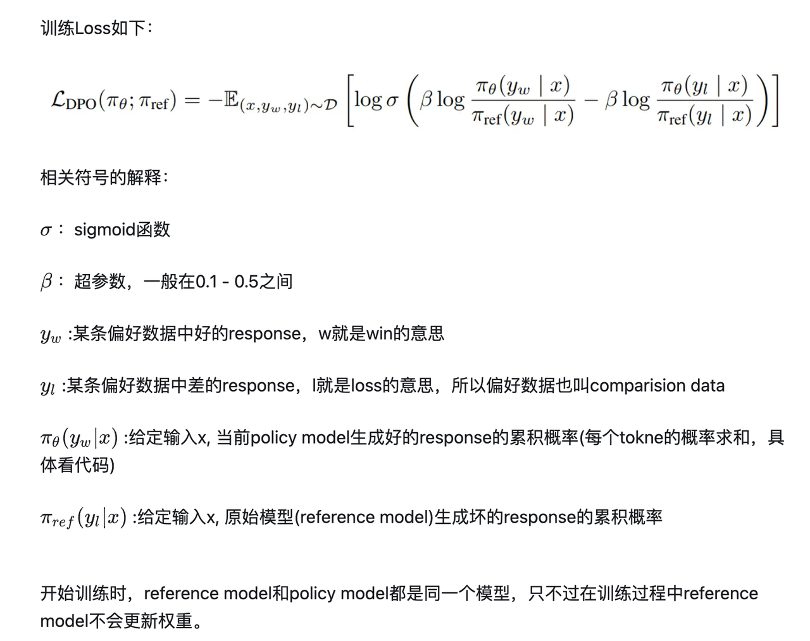
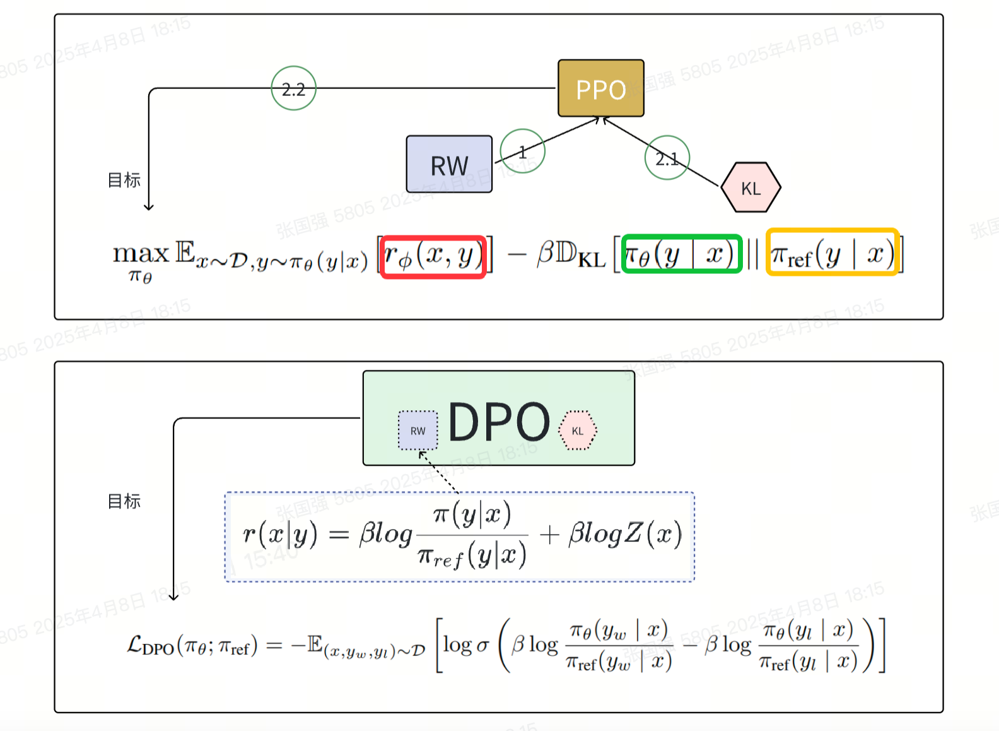
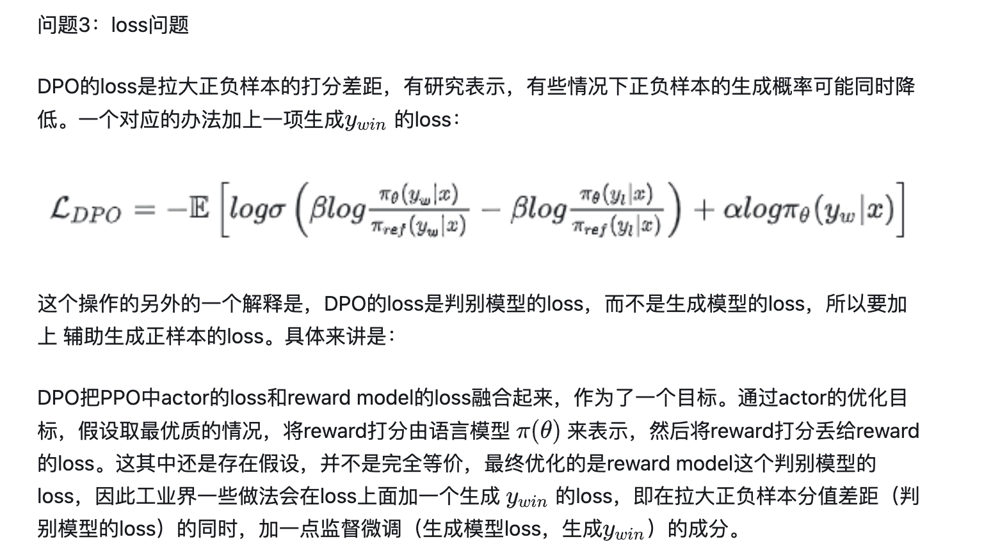
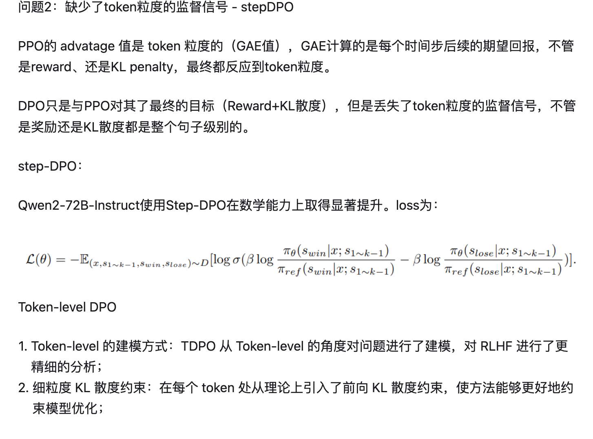
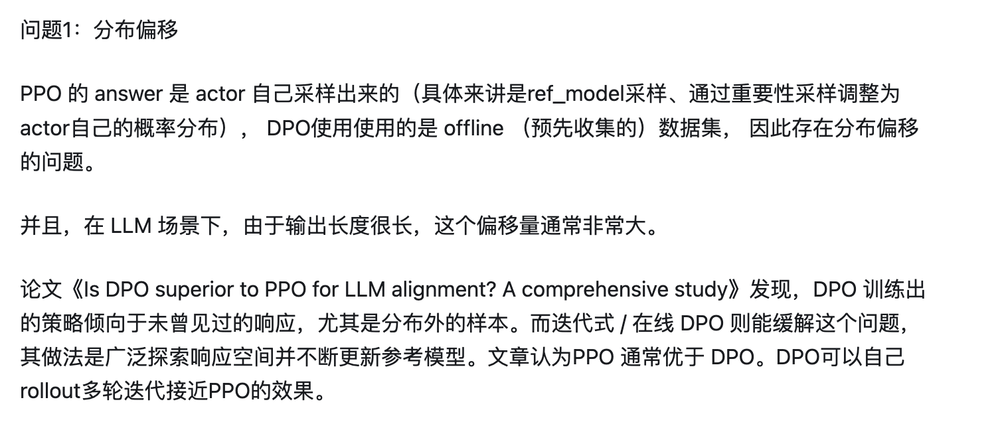

# 概率
23年1月份发表论文。

# DPO解决的问题
RLHF存在问题：RLHF是一个复杂的过程，优先需要训练并你和人类偏好的奖励模型，然后利用强化学习微调无监督LM模型，以最大化这种估计奖励，而不会偏离原始模型太远。

DPO优化：通过利用奖励函数和最优策略之间的映射关系，证明这个受限的奖励最大化问题可以通过单阶段的策略来进行优化，本质上是在人类偏好数据上解决一个分类问题。

DPO工作原理：增加偏好样本的对数概率，同时减少非便好样本的对数概率。结合了动态加权机制，防止在使用概率比目标时遇到模型退化问题。

DPO理论基础：理论上依赖偏好模型，如Bradley-Terry，来测量奖励函数和偏好数据的对齐程度。传统的方式，采用偏好数据训练奖励模型，然后通过奖励模型训练策略。DPO直接通过策略定义偏好损失，可以使用简单的二元交叉熵目标来优化策略，无需在训练过程中明确学习奖励函数或从策略中进行采样。

# Bradley-Terry model

该模型衡量给定的奖励函数和经验偏好数据的一致程度。

# 存在问题

# reference

[Direct Preference Optimization: Your Language Model is Secretly a Reward Model](https://arxiv.org/pdf/2305.18290)

[Training language models to follow instructions with human feedback](https://arxiv.org/pdf/2203.02155)

[Deep Reinforcement Learning from Human Preferences](https://arxiv.org/pdf/1706.03741)

[DPO公式推导](https://zhuanlan.zhihu.com/p/653975451)

[DPO代码](https://github.com/chunhuizhang/personal_chatgpt/blob/main/tutorials/trl_hf/trl_dpo.ipynb)

[DPO公式推导](https://github.com/chunhuizhang/personal_chatgpt/blob/main/tutorials/trl_hf/dpo_math.ipynb)

Code: https://github.com/eric-mitchell/direct-preference-optimization

