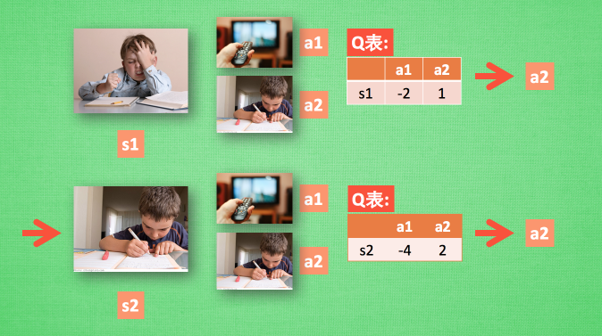
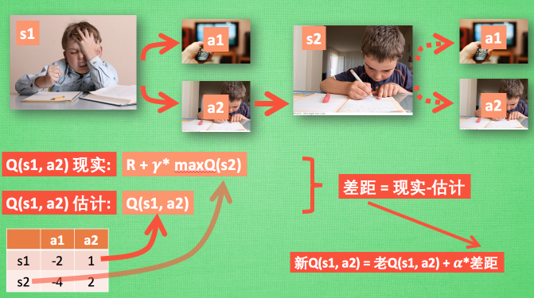
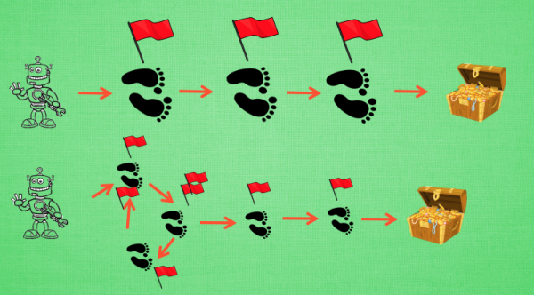
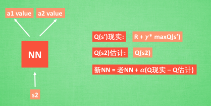

# 莫烦强化学习笔记


[TOC]


## 简介

### 对比监督学习

> 监督学习对已经有了数据和对应的正确标签进行学习


> 强化学习通过一次次环境中的尝试获取到数据和"标签"的交互序列，然后通过学习一些规律，这些规律尽可能带来更高的回报


### RL 算法家族


> 使用表格学习： Q Learning, Sarsa

> 使用深度神经网络学习： deep Q network

> 直接输出行为 : Policy Gradients

> 从虚拟环境中学习： Model based RL


### 强化学习分类汇总

#### Model-free and Model-based

根据理解不理解环境，将强化学习的方法Model-free和Model-based，这里的Model即为环境


> Model-free: 不尝试理解环境，环境给了我们什么就是什么，从环境的反馈中学习，所有的环境都是现实的。如Q-learning, Sarsa, Policy Gradients

> Model-based: 通过过往的经验，先理解真实世界是怎样的，并建立一个模型来模拟现实世界的反馈。相比Model-free，只是多出了一个虚拟环境(可以理解为想象力)

> 对比：Model-free，只能按部就班，一步一步等待真实世界的反馈，在根据反馈采取下一步的行动； 而Model-based，能通过想象来判断接下来要发生的所有情况，然后选择这个想象情况中最好的那种，并依据这些情况来采取下一步的策略.


#### 基于概率和基于价值


> 基于概率： 通过分析所处的环境，直接输出下一步要采取各种行动的概率，然后根据概率采取行动，所以每种行动都可能会被选中，只是可能性不同。如Policy Gradients

> 基于价值：输出所有行动的价值，然后根据最高的价值选择行动。 如Q learning, Sarsa

> Actor-Critic：将基于概率和价值相结合的方式，actor基于概率作出行动，critic 会对作出的动作给出动作的价值，可以加快学习过程

#### 回合更新和单步更新


> 回合更新：是指在游戏开始一直等到结束后，再总结这一回合中的所有转折点，然后再更新策略。如Monte-carlo learning, basic policy gradients

> 单步更新：在游戏中每一步都更新策略，即边学边玩。Q-learning, Sarsa, 升级版的policy gradients.


#### 在线学习和离线学习


> 在线学习：必须是本人在场，并且一定是本人边玩边学。如Sarsa, Sarsa lambda

> 离线学习：可以选择和自己玩，也可以选择和别人玩，通过看别人来学习别人的policy。可以是过往的经验，也可以存储下来的记忆。如Q-learning, Deep-Q-Network


### 学习模块

[OpenAI gym](https://gym.openai.com/)

[莫烦tensorflow](https://morvanzhou.github.io/tutorials/machine-learning/tensorflow/)

[莫烦numpy pandas](https://morvanzhou.github.io/tutorials/data-manipulation/np-pd/)

[有趣的机器学习 播放列表](https://morvanzhou.github.io/tutorials/machine-learning/ML-intro/)

[matplotlib](https://morvanzhou.github.io/tutorials/data-manipulation/plt/)

[tkinter编写模拟环境](https://morvanzhou.github.io/tutorials/python-basic/tkinter/)

[pytorch](https://morvanzhou.github.io/tutorials/machine-learning/torch/)

[从头开始做一个机器手臂1 搭建结构](https://morvanzhou.github.io/tutorials/machine-learning/ML-practice/RL-build-arm-from-scratch1/)

[karpathy blog](http://karpathy.github.io/2016/05/31/rl/)

[CS231n Convolutional Neural Networks for Visual Recognition](http://cs231n.github.io/neural-networks-2/#losses)

[DeepMind blog](https://deepmind.com/blog/)

## OpenAi gym

### install

```bash
# MacOS:
$ brew install cmake boost boost-python sdl2 swig wget

# Ubuntu 14.04:
$ apt-get install -y python-numpy python-dev cmake zlib1g-dev libjpeg-dev xvfb libav-tools xorg-dev python-opengl libboost-all-dev libsdl2-dev swig

# python 2.7, 复制下面
$ pip install gym[all]

# python 3.5, 复制下面
$ pip3 install gym[all]


```


## Q-learning

### 强化学习算法主体


Q-learning 每次更新都用到了Q现实和Q估计，而且 Q learning 的迷人之处就是 在 Q(s1, a2) 现实 中, 也包含了一个 Q(s2) 的最大估计值, 将对下一步的衰减的最大估计和当前所得到的奖励当成这一步的现实。Epsilon greedy 是用在决策上的一种策略, 比如 epsilon = 0.9 时, 就说明有90% 的情况我会按照 Q 表的最优值选择行为, 10% 的时间使用随机选行为. alpha是学习率, 来决定这次的误差有多少是要被学习的, alpha是一个小于1 的数. gamma 是对未来 reward 的衰减值

Q-learning 通过Q表的决策过程


> 假设我们的行为准则已经学习好了, 现在我们处于状态s1, 我在写作业, 我有两个行为 a1, a2, 分别是看电视和写作业, 根据我的经验, 在这种 s1 状态下, a2 写作业 带来的潜在奖励要比 a1 看电视高, 这里的潜在奖励我们可以用一个有关于 s 和 a 的 Q 表格代替, 在我的记忆Q表格中, Q(s1, a1)=-2 要小于 Q(s1, a2)=1, 所以我们判断要选择 a2 作为下一个行为. 现在我们的状态更新成 s2 , 我们还是有两个同样的选择, 重复上面的过程, 在行为准则Q 表中寻找 Q(s2, a1) Q(s2, a2) 的值, 并比较他们的大小, 选取较大的一个. 接着根据 a2 我们到达 s3 并在此重复上面的决策过程. Q learning 的方法也就是这样决策的

Q表更新过程



>  根据 Q 表的估计, 因为在 s1 中, a2 的值比较大, 通过之前的决策方法, 我们在 s1 采取了 a2, 并到达 s2, 这时我们开始更新用于决策的 Q 表, 接着我们并没有在实际中采取任何行为, 而是再想象自己在 s2 上采取了每种行为, 分别看看两种行为哪一个的 Q 值大, 比如说 Q(s2, a2) 的值比 Q(s2, a1) 的大, 所以我们把大的 Q(s2, a2) 乘上一个衰减值 gamma (比如是0.9) 并加上到达s2时所获取的奖励 R (这里还没有获取到我们的棒棒糖, 所以奖励为 0), 因为会获取实实在在的奖励 R , 我们将这个作为我现实中 Q(s1, a2) 的值, 但是我们之前是根据 Q 表估计 Q(s1, a2) 的值. 所以有了现实和估计值, 我们就能更新Q(s1, a2) , 根据 估计与现实的差距, 将这个差距乘以一个学习效率 alpha 累加上老的 Q(s1, a2) 的值 变成新的值. 但时刻记住, 我们虽然用 maxQ(s2) 估算了一下 s2 状态, 但还没有在 s2 做出任何的行为, s2 的行为决策要等到更新完了以后再重新另外做. 这就是 off-policy 的 Q learning 是如何决策和学习优化决策的过程.

Q-learning中的Gamma


> 我们重写一下 Q(s1) 的公式, 将 Q(s2) 拆开, 因为Q(s2)可以像 Q(s1)一样,是关于Q(s3) 的, 所以可以写成这样, 然后以此类推, 不停地这样写下去, 最后就能写成这样, 可以看出Q(s1) 是有关于之后所有的奖励, 但这些奖励正在衰减, 离 s1 越远的状态衰减越严重. 不好理解? 行, 我们想象 Qlearning 的机器人天生近视眼, gamma = 1 时, 机器人有了一副合适的眼镜, 在 s1 看到的 Q 是未来没有任何衰变的奖励, 也就是机器人能清清楚楚地看到之后所有步的全部价值, 但是当 gamma =0, 近视机器人没了眼镜, 只能摸到眼前的 reward, 同样也就只在乎最近的大奖励, 如果 gamma 从 0 变到 1, 眼镜的度数由浅变深, 对远处的价值看得越清楚, 所以机器人渐渐变得有远见, 不仅仅只看眼前的利益, 也为自己的未来着想.

### first example of tabular Q-learning

> 例子的环境是一个一维世界, 在世界的右边有宝藏, 探索者只要得到宝藏尝到了甜头, 然后以后就记住了得到宝藏的方法, 这就是他用强化学习所学习到的行为.


```bash
-o---T
# T 就是宝藏的位置, o 是探索者的位置
```

> Q-learning 是一种记录行为值 (Q value) 的方法, 每种在一定状态的行为都会有一个值 Q(s, a), 就是说 行为 a 在 s 状态的值是 Q(s, a). s 在上面的探索者游戏中, 就是 o 所在的地点了. 而每一个地点探索者都能做出两个行为 left/right, 这就是探索者的所有可行的 a 啦.
如果在某个地点 s1, 探索者计算了他能有的两个行为, a1/a2=left/right, 计算结果是 Q(s1, a1) > Q(s1, a2), 那么探索者就会选择 left 这个行为. 这就是 Q learning 的行为选择简单规则.


## Sarsa

### Sarsa 决策


> Sarsa 的决策部分和 Q learning 一模一样, 因为我们使用的是 Q 表的形式决策, 所以我们会在 Q 表中挑选值较大的动作值施加在环境中来换取奖惩. 但是不同的地方在于 Sarsa 的更新方式是不一样的.

### Sarsa 行为更新准则


> 同样, 我们会经历正在写作业的状态 s1, 然后再挑选一个带来最大潜在奖励的动作 a2, 这样我们就到达了 继续写作业状态 s2, 而在这一步, 如果你用的是 Q learning, 你会观看一下在 s2 上选取哪一个动作会带来最大的奖励, 但是在真正要做决定时, 却不一定会选取到那个带来最大奖励的动作, Q-learning 在这一步只是估计了一下接下来的动作值. 而 Sarsa 是实践派, 他说到做到, 在 s2 这一步估算的动作也是接下来要做的动作. 所以 Q(s1, a2) 现实的计算值, 我们也会稍稍改动, 去掉maxQ, 取而代之的是在 s2 上我们实实在在选取的 a2 的 Q 值. 最后像 Q learning 一样, 求出现实和估计的差距 并更新 Q 表里的 Q(s1, a2).


### 对比Q-learning 和Sarsa


> 他在当前 state 已经想好了 state 对应的 action, 而且想好了 下一个 state_ 和下一个 action_ (Qlearning 还没有想好下一个 action_)

> 更新 Q(s,a) 的时候基于的是下一个 Q(s_, a_) (Qlearning 是基于 maxQ(s_))

> 从算法来看, 这就是他们两最大的不同之处了. 因为 Sarsa 是说到做到型, 所以我们也叫他 on-policy, 在线学习, 学着自己在做的事情. 而 Q learning 是说到但并不一定做到, 所以它也叫作 Off-policy, 离线学习. 而因为有了 maxQ, Q-learning 也是一个特别勇敢的算法.因为 Q learning 机器人 永远都会选择最近的一条通往成功的道路, 不管这条路会有多危险. 而 Sarsa 则是相当保守, 他会选择离危险远远的, 拿到宝藏是次要的, 保住自己的小命才是王道. 这就是使用 Sarsa 方法的不同之处

> Sarsa 只能根据自己的经验来学习


### Sarsa(lambda)

#### Sarsa(n)


> Sarsa 是on-policy, 一种单步更新法, 在环境中每走一步, 更新一次自己的行为准则, 我们可以在这样的 Sarsa 后面打一个括号, 说他是 Sarsa(0), 因为他等走完这一步以后直接更新行为准则. 如果延续这种想法, 走完这步, 再走一步, 然后再更新, 我们可以叫他 Sarsa(1). 同理, 如果等待回合完毕我们一次性再更新呢, 比如这回合我们走了 n 步, 那我们就叫 Sarsa(n). 为了统一这样的流程, 我们就有了一个 lambda 值来代替我们想要选择的步数, 这也就是 Sarsa(lambda) 的由来

#### 单步更新和回合更新




> 回合更新虽然我要等到这回合结束, 才开始对本回合所经历的所有步都添加更新, 但是这所有的步都是和宝藏有关系的, 都是为了得到宝藏需要学习的步, 所以每一个脚印在下回合被选则的几率又高了一些. 在这种角度来看, 回合更新似乎会有效率一些.

> 使用单步更新的方法在每一步都进行更新, 但是同时记下之前的寻宝之路. 你可以想像, 每走一步, 插上一个小旗子, 这样我们就能清楚的知道除了最近的一步, 找到宝物时还需要更新哪些步了. 不过, 有时候情况可能没有这么乐观. 开始的几次, 因为完全没有头绪, 我可能在原地打转了很久, 然后才找到宝藏, 那些重复的脚步真的对我拿到宝藏很有必要吗? 答案我们都知道. 所以Sarsa(lambda)

#### lambda 含义和取值


> 其实 lambda 就是一个衰变值, 他可以让你知道离奖励越远的步可能并不是让你最快拿到奖励的步, 所以我们想象我们站在宝藏的位置, 回头看看我们走过的寻宝之路, 离宝藏越近的脚印越看得清, 远处的脚印太渺小, 我们都很难看清, 那我们就索性记下离宝藏越近的脚印越重要, 越需要被好好的更新. 和之前我们提到过的 奖励衰减值 gamma 一样, lambda 是脚步衰减值, 都是一个在 0 和 1 之间的数.


> 当 lambda 取0, 就变成了 Sarsa 的单步更新, 当 lambda 取 1, 就变成了回合更新, 对所有步更新的力度都是一样. 当 lambda 在 0 和 1 之间, 取值越大, 离宝藏越近的步更新力度越大. 这样我们就不用受限于单步更新的每次只能更新最近的一步, 我们可以更有效率的更新所有相关步了.


#### sarsa lambda 算法主体


## Deep Q Network

### papaer

[Playing Atari with Deep Reinforcement Learning](https://arxiv.org/abs/1312.5602)

### 强化学习与神经网络

> Deep Q Network 的简称叫 DQN, 是将 Q learning 的优势 和 Neural networks 结合了. 如果我们使用 tabular Q learning, 对于每一个 state, action 我们都需要存放在一张 q_table 的表中. 如果像显示生活中, 情况可就比那个迷宫的状况复杂多了, 我们有千千万万个 state, 如果将这千万个 state 的值都放在表中, 受限于我们计算机硬件, 这样从表中获取数据, 更新数据是没有效率的. 这就是 DQN 产生的原因了. 我们可以使用神经网络来 估算 这个 state 的值, 这样就不需要一张表了


### 神经网络的作用


> 在机器学习中, 有一种方法对这种事情很在行, 那就是神经网络. 我们可以将状态和动作当成神经网络的输入, 然后经过神经网络分析后得到动作的 Q 值, 这样我们就没必要在表格中记录 Q 值, 而是直接使用神经网络生成 Q 值.
 
> 还有一种形式的是这样, 我们也能只输入状态值, 输出所有的动作值, 然后按照 Q learning 的原则, 直接选择拥有最大值的动作当做下一步要做的动作. 我们可以想象, 神经网络接受外部的信息, 相当于眼睛鼻子耳朵收集信息, 然后通过大脑加工输出每种动作的值, 最后通过强化学习的方式选择动作.

### 更新神经网络



> 基于第二种神经网络来分析, 我们知道, 神经网络是要被训练才能预测出准确的值. 那在强化学习中, 神经网络是如何被训练的呢? 首先, 我们需要 a1, a2 正确的Q值, 这个 Q 值我们就用之前在 Q learning 中的 Q 现实来代替. 同样我们还需要一个 Q 估计 来实现神经网络的更新. 所以神经网络的的参数就是老的 NN 参数 加学习率 alpha 乘以 Q 现实 和 Q 估计 的差距


> 通过 NN 预测出Q(s2, a1) 和 Q(s2,a2) 的值, 这就是 Q 估计. 然后我们选取 Q 估计中最大值的动作来换取环境中的奖励 reward. 而 Q 现实中也包含从神经网络分析出来的两个 Q 估计值, 不过这个 Q 估计是针对于下一步在 s’ 的估计. 最后再通过刚刚所说的算法更新神经网络中的参数. 但是这并不是 DQN 会玩电动的根本原因. 还有两大因素支撑着 DQN 使得它变得无比强大. 这两大因素就是 Experience replay 和 Fixed Q-targets

### DQN两大利器-Experience replay 和 Fixed Q-targets.


> DQN 有一个记忆库用于学习之前的经历. 在之前的简介影片中提到过, Q learning 是一种 off-policy 离线学习法, 它能学习当前经历着的, 也能学习过去经历过的, 甚至是学习别人的经历. 所以每次 DQN 更新的时候, 我们都可以随机抽取一些之前的经历进行学习. 随机抽取这种做法打乱了经历之间的相关性, 也使得神经网络更新更有效率

> Fixed Q-targets 也是一种打乱相关性的机理, 如果使用 fixed Q-targets, 我们就会在 DQN 中使用到两个结构相同但参数不同的神经网络, 预测 Q 估计 的神经网络具备最新的参数, 而预测 Q 现实 的神经网络使用的参数则是很久以前的. 有了这两种提升手段, DQN 才能在一些游戏中超越人类

### Algorithm1: Deep Q-learning with experience replay


> 如果简单的使用神经网络，可能会存在难以收敛的问题，因此可以用记忆库(experience replay)和fixed Q-targets

#### 记忆库(用于重复学习)

> Q-learning 是一种off-policy，可以学习之前的经验或者别人的经验，因此记忆库就是存储这些记忆的，然后离散的调用或者随机的调用记忆库中已经记忆好的记忆，切断相关性的方法可以使神经网络更有效率的学习。

#### 神经网络计算Q值

#### 暂时冻结q_target参数(切断相关性)

> 在强化学习中，有Q-learning 中分为Q-现实和Q-估计。神经网络中有很多的参数，在Q-现实中我们可以暂时冻结神经网络的一些参数，使它是一个很久以前的，没被更新参数；Q-估计，是一个实时被更新的参数。这种有时差的更新也是一种切段相关性的方法，使神经网络更有效率的收敛起来，达到一个好的效果


### Double DQN

#### paper

[Double DQN](https://arxiv.org/abs/1509.06461)

#### 对比DQN和Double DQN

> 一句话概括, DQN 基于 Q-learning, Q-Learning 中有 Qmax, Qmax 会导致 Q现实 当中的过估计 (overestimate). 而 Double DQN 就是用来解决过估计的. 在实际问题中, 如果你输出你的 DQN 的 Q 值, 可能就会发现, Q 值都超级大. 这就是出现了 overestimate

#### Double DQN 算法


> 我们知道 DQN 的神经网络部分可以看成一个 最新的神经网络 + 老神经网络, 他们有相同的结构, 但内部的参数更新却有时差. 而它的 Q现实 部分是这样的


> 因为我们的神经网络预测 Qmax 本来就有误差, 每次也向着最大误差的 Q现实 改进神经网络, 就是因为这个 Qmax 导致了 overestimate. 所以 Double DQN 的想法就是引入另一个神经网络来打消一些最大误差的影响. 而 DQN 中本来就有两个神经网络, 我们何不利用一下这个地理优势呢. 所以, 我们用 Q估计 的神经网络估计 Q现实 中 Qmax(s', a') 的最大动作值. 然后用这个被 Q估计 估计出来的动作来选择 Q现实 中的 Q(s'). 总结一下:

> 有两个神经网络: Q_eval (Q估计中的), Q_next (Q现实中的).
原本的 Q_next = max(Q_next(s', a_all)).
Double DQN 中的 Q_next = Q_next(s', argmax(Q_eval(s', a_all))). 也可以表达成下面那样.


### Prioritized Experience Repaly(DQN)

#### paper

[Prioritized Experience Repaly(DQN)](https://arxiv.org/pdf/1511.05952.pdf)

[LET’S MAKE A DQN: DOUBLE LEARNING AND PRIORITIZED EXPERIENCE REPLAY](https://jaromiru.com/2016/11/07/lets-make-a-dqn-double-learning-and-prioritized-experience-replay/)

#### 要点

> 这一次还是使用 MountainCar 来进行实验, 因为这次我们不需要重度改变他的 reward 了. 所以只要是没有拿到小旗子, reward=-1, 拿到小旗子时, 我们定义它获得了 +10 的 reward. 比起之前 DQN 中, 这个 reward 定义更加准确. 如果使用这种 reward 定义方式, 可以想象 Natural DQN 会花很久的时间学习, 因为记忆库中只有很少很少的 +10 reward 可以学习. 正负样本不一样. 而使用 Prioritized replay, 就会重视这种少量的, 但值得学习的样本.

#### 算法主体


> 这一套算法重点就在我们 batch 抽样的时候并不是随机抽样, 而是按照 Memory 中的样本优先级来抽. 所以这能更有效地找到我们需要学习的样本.

> 那么样本的优先级是怎么定的呢? 原来我们可以用到 TD-error, 也就是 Q现实 - Q估计 来规定优先学习的程度. 如果 TD-error 越大, 就代表我们的预测精度还有很多上升空间, 那么这个样本就越需要被学习, 也就是优先级 p 越高.

> 有了 TD-error 就有了优先级 p, 那我们如何有效地根据 p 来抽样呢? 如果每次抽样都需要针对 p 对所有样本排序, 这将会是一件非常消耗计算能力的事. 好在我们还有其他方法, 这种方法不会对得到的样本进行排序. 这就是这篇 paper 中提到的 SumTree.

> SumTree 是一种树形结构, 每片树叶存储每个样本的优先级 p, 每个树枝节点只有两个分叉, 节点的值是两个分叉的合, 所以 SumTree 的顶端就是所有 p 的合. 正如下面图片(来自Jaromír Janisch), 最下面一层树叶存储样本的 p, 叶子上一层最左边的 13 = 3 + 10, 按这个规律相加, 顶层的 root 就是全部 p 的合了.


> 抽样时, 我们会将 p 的总合 除以 batch size, 分成 batch size 那么多区间, (n=sum(p)/batch_size). 如果将所有 node 的 priority 加起来是42的话, 我们如果抽6个样本, 这时的区间拥有的 priority 可能是这样.

> [0-7], [7-14], [14-21], [21-28], [28-35], [35-42]

> 然后在每个区间里随机选取一个数. 比如在第区间 [21-28] 里选到了24, 就按照这个 24 从最顶上的42开始向下搜索. 首先看到最顶上 42 下面有两个 child nodes, 拿着手中的24对比左边的 child 29, 如果 左边的 child 比自己手中的值大, 那我们就走左边这条路, 接着再对比 29 下面的左边那个点 13, 这时, 手中的 24 比 13 大, 那我们就走右边的路, 并且将手中的值根据 13 修改一下, 变成 24-13 = 11. 接着拿着 11 和 16 左下角的 12 比, 结果 12 比 11 大, 那我们就选 12 当做这次选到的 priority, 并且也选择 12 对应的数据.

#### Memory 类

> 在paper 中, ISWeight = (N*Pj)^(-beta) / maxi_wi 里面的 maxi_wi 是为了 normalize ISWeight, 所以我们先把他放在一边. 所以单纯的 importance sampling 就是 (N*Pj)^(-beta), 那 maxi_wi = maxi[(N*Pi)^(-beta)].

> 如果将这两个式子合并,

> ISWeight = (N*Pj)^(-beta) / maxi[ (N*Pi)^(-beta) ]

> 而且如果将 maxi[ (N*Pi)^(-beta) ] 中的 (-beta) 提出来, 这就变成了 mini[ (N*Pi) ] ^ (-beta)

> 看出来了吧, 有的东西可以抵消掉的. 最后

> ISWeight = (Pj / mini[Pi])^(-beta)

> 这样我们就有了代码中的样子.

> 还有代码中的 alpha 是一个决定我们要使用多少 ISweight 的影响, 如果 alpha = 0, 我们就没使用到任何 Importance Sampling.


### Dueling DQN

> Dueling DQN 就是. 它将每个动作的 Q 拆分成了 state 的 Value 加上 每个动作的 Advantage.

#### papaer

[dueling DQN](https://arxiv.org/pdf/1511.06581.pdf)

#### Dueling 算法


> 上一个 Paper 中的经典解释图片, 上者是一般的 DQN 的 Q值 神经网络. 下者就是 Dueling DQN 中的 Q值 神经网络了. 那具体是哪里不同了呢

> 下面这个公式解释了不同之处. 原来 DQN 神经网络直接输出的是每种动作的 Q值, 而 Dueling DQN 每个动作的 Q值 是有下面的公式确定的


> 它分成了这个 state 的值, 加上每个动作在这个 state 上的 advantage. 因为有时候在某种 state, 无论做什么动作, 对下一个 state 都没有多大影响. 比如 paper 中的这张图


> 这是开车的游戏, 左边是 state value, 发红的部分证明了 state value 和前面的路线有关, 右边是 advantage, 发红的部分说明了 advantage 很在乎旁边要靠近的车子, 这时的动作会受更多 advantage 的影响. 发红的地方左右了自己车子的移动原则


## Policy Gradient

### paper

[Policy gradient methods for reinforcement learning with function approximation.](https://papers.nips.cc/paper/1713-policy-gradient-methods-for-reinforcement-learning-with-function-approximation.pdf)

### 和其它强化学习方法的不同

> 强化学习是一个通过奖惩来学习正确行为的机制. 家族中有很多种不一样的成员, 有学习奖惩值, 根据自己认为的高价值选行为, 比如 Q learning, Deep Q Network, 也有不通过分析奖励值, 直接输出行为的方法, 这就是今天要说的 Policy Gradients 了. 甚至我们可以为 Policy Gradients 加上一个神经网络来输出预测的动作. 对比起以值为基础的方法, Policy Gradients 直接输出动作的最大好处就是, 它能在一个连续区间内挑选动作, 而基于值的, 比如 Q-learning, 它如果在无穷多的动作中计算价值, 从而选择行为, 这, 它可吃不消

> Policy gradient 是 RL 中另外一个大家族, 他不像 Value-based 方法 (Q learning, Sarsa), 但他也要接受环境信息 (observation), 不同的是他要输出不是 action 的 value, 而是具体的那一个 action, 这样 policy gradient 就跳过了 value 这个阶段. 而且个人认为 Policy gradient 最大的一个优势是: 输出的这个 action 可以是一个连续的值, 之前我们说到的 value-based 方法输出的都是不连续的值, 然后再选择值最大的 action. 而 policy gradient 可以在一个连续分布上选取 action.

> 优势：Q-learning是一个离散化的动作点的输出，然后选择某一个动作输出来；如果碰到一种连续动作的问题，比如开汽车，速度不是一个一个点速度，它是一个连续分布中间挑选一个速度，这种问题Policy Gradient就是一个很好的解决方法

### 反向传递与更新


> 有了神经网络当然方便, 但是, 我们怎么进行神经网络的误差反向传递呢? Policy Gradients 的误差又是什么呢? 答案是! 哈哈, 没有误差! 但是他的确是在进行某一种的反向传递. 这种反向传递的目的是让这次被选中的行为更有可能在下次发生. 但是我们要怎么确定这个行为是不是应当被增加被选的概率呢? 这时候我们的老朋友, reward 奖惩正可以在这时候派上用场


> 现在我们来演示一遍, 观测的信息通过神经网络分析, 选出了左边的行为, 我们直接进行反向传递, 使之下次被选的可能性增加, 但是奖惩信息却告诉我们, 这次的行为是不好的, 那我们的动作可能性增加的幅度 随之被减低. 这样就能靠奖励来左右我们的神经网络反向传递. 我们再来举个例子, 假如这次的观测信息让神经网络选择了右边的行为, 右边的行为随之想要进行反向传递, 使右边的行为下次被多选一点, 这时, 奖惩信息也来了, 告诉我们这是好行为, 那我们就在这次反向传递的时候加大力度, 让它下次被多选的幅度更猛烈! 这就是 Policy Gradients 的核心思想了. 很简单吧.

### 算法主体

> policy gradient 的第一个算法是一种基于 整条回合数据 的更新, 也叫 REINFORCE 方法. 这种方法是 policy gradient 的最基本方法, 有了这个的基础, 我们再来做更高级的


> log(Policy(s,a))*V 中的 log(Policy(s,a)) 表示在 状态 s 对所选动作 a 的吃惊度, 如果 Policy(s,a) 概率越小, 反向的 log(Policy(s,a)) (即 -log(P)) 反而越大. 如果在 Policy(s,a) 很小的情况下, 拿到了一个 大的 R, 也就是 大的 V, 那 -log(Policy(s, a))*V 就更大, 表示更吃惊, (我选了一个不常选的动作, 却发现原来它能得到了一个好的 reward, 那我就得对我这次的参数进行一个大幅修改). 这就是 log(Policy)*V 的物理意义啦.


## Actor Critic

### 什么是Actor Critic

> 今天我们会来说说强化学习中的一种结合体 Actor Critic (演员评判家), 它合并了 以值为基础 (比如 Q learning) 和 以动作概率为基础 (比如 Policy Gradients) 两类强化学习算法

#### 为什么要有 Actor 和 Critic


> 我们有了像 Q-learning 这么伟大的算法, 为什么还要瞎折腾出一个 Actor-Critic? 原来 Actor-Critic 的 Actor 的前生是 Policy Gradients, 这能让它毫不费力地在连续动作中选取合适的动作, 而 Q-learning 做这件事会瘫痪. 那为什么不直接用 Policy Gradients 呢? 原来 Actor Critic 中的 Critic 的前生是 Q-learning 或者其他的 以值为基础的学习法 , 能进行单步更新, 而传统的 Policy Gradients 则是回合更新, 这降低了学习效率.

#### Actor 和 Critic


> 现在我们有两套不同的体系, Actor 和 Critic, 他们都能用不同的神经网络来代替 . 在 Policy Gradients 的影片中提到过, 现实中的奖惩会左右 Actor 的更新情况. Policy Gradients 也是靠着这个来获取适宜的更新. 那么何时会有奖惩这种信息能不能被学习呢? 这看起来不就是 以值为基础的强化学习方法做过的事吗. 那我们就拿一个 Critic 去学习这些奖惩机制, 学习完了以后. 由 Actor 来指手画脚, 由 Critic 来告诉 Actor 你的那些指手画脚哪些指得好, 哪些指得差, Critic 通过学习环境和奖励之间的关系, 能看到现在所处状态的潜在奖励, 所以用它来指点 Actor 便能使 Actor 每一步都在更新, 如果使用单纯的 Policy Gradients, Actor 只能等到回合结束才能开始更新.

#### 增加单步更新属性


> 但是事物终有它坏的一面, Actor-Critic 涉及到了两个神经网络, 而且每次都是在连续状态中更新参数, 每次参数更新前后都存在相关性, 导致神经网络只能片面的看待问题, 甚至导致神经网络学不到东西. Google DeepMind 为了解决这个问题, 修改了 Actor Critic 的算法,

#### DDPG(改进版 Deep Deterministic Policy Gradient)


> 将之前在电动游戏 Atari 上获得成功的 DQN 网络加入进 Actor Critic 系统中, 这种新算法叫做 Deep Deterministic Policy Gradient, 成功的解决的在连续动作预测上的学不到东西问题. 所以之后, 我们再来说说什么是这种高级版本的 Deep Deterministic Policy Gradient 吧.

### Actor Critic

#### 要点

> 一句话概括 Actor Critic 方法:

> 结合了 Policy Gradient (Actor) 和 Function Approximation (Critic) 的方法. Actor 基于概率选行为, Critic 基于 Actor 的行为评判行为的得分, Actor 根据 Critic 的评分修改选行为的概率.

> Actor Critic 方法的优势: 可以进行单步更新, 比传统的 Policy Gradient 要快.

> Actor Critic 方法的劣势: 取决于 Critic 的价值判断, 但是 Critic 难收敛, 再加上 Actor 的更新, 就更难收敛. 为了解决收敛问题, Google Deepmind 提出了 Actor Critic 升级版 Deep Deterministic Policy Gradient. 后者融合了 DQN 的优势, 解决了收敛难的问题. 我们之后也会要讲到 Deep Deterministic Policy Gradient. 不过那个是要以 Actor Critic 为基础, 懂了 Actor Critic, 后面那个就好懂了.

#### 算法核心思想


> Actor 在实际中做各种的动作，而Critic来告诉Actor现在的动作是好的还是坏的。是好的话，就加大幅度更新; 是坏的话，就减小幅度更新。

> Actor 修改行为时就像蒙着眼睛一直向前开车, Critic 就是那个扶方向盘改变 Actor 开车方向的. 或者说详细点, 就是 Actor 在运用 Policy Gradient 的方法进行 Gradient ascent 的时候, 由 Critic 来告诉他, 这次的 Gradient ascent 是不是一次正确的 ascent, 如果这次的得分不好, 那么就不要 ascent 那么多.

#### 神经网络结构


> actor 预测行为概率。输入是一个state，根据这个状态，生成处各种行为的价值，比如向左走有60%的概率，向右走有40%的概率，选择行为的时候就根据这个概率来选择。神经网络输出概率(p)，通过概率来优化我们的行为，而在优化行为的时候同Policy gradient 类似，通过log(p) * 加工之后的reward(即discounted_ep_rs)，而在actor critic中，乘的这个数是critic告诉actor个一个数，成为td-error,即下一个状态是不是比这个状态要好还是差，从而影响下一个状态是增大更新或者减小更新的。


> critic 预测在这个状态下的价值。 输入是一个状态，输出是状态的值；输入下一个状态，输出下一个状态的值 + 获取的reward - 上一个状态的值就是td-error了。


### DDPG

> actor critic 的提升方式 Deep Deterministic Policy Gradient (DDPG), DDPG 最大的优势就是能够在连续动作上更有效地学习

> 一句话概括 DDPG: Google DeepMind 提出的一种使用 Actor Critic 结构, 但是输出的不是行为的概率, 而是具体的行为, 用于连续动作 (continuous action) 的预测. DDPG 结合了之前获得成功的 DQN 结构, 提高了 Actor Critic 的稳定性和收敛性

#### paper

[Continuous control with deep reinforcement learning](https://arxiv.org/abs/1509.02971)

#### 拆分细讲


> 它吸收了 Actor-Critic 让 Policy gradient 单步更新的精华, 而且还吸收让计算机学会玩游戏的 DQN 的精华, 合并成了一种新算法, 叫做 Deep Deterministic Policy Gradient. 那 DDPG 到底是什么样的算法呢, 我们就拆开来分析, 我们将 DDPG 分成 ‘Deep’ 和 ‘Deterministic Policy Gradient’, 然后 ‘Deterministic Policy Gradient’ 又能被细分为 ‘Deterministic’ 和 ‘Policy Gradient’, 接下来, 我们就开始一个个分析啦.

#### Deep 和 DQN


> Deep 顾名思义, 就是走向更深层次, 我们在 DQN 的影片当中提到过, 使用一个记忆库和两套结构相同, 但参数更新频率不同的神经网络能有效促进学习. 那我们也把这种思想运用到 DDPG 当中, 使 DDPG 也具备这种优良形式. 但是 DDPG 的神经网络形式却比 DQN 的要复杂一点点.

#### Deterministic Policy Gradient


> Policy gradient 我们也在之前的短片中提到过, 相比其他的强化学习方法, 它能被用来在连续动作上进行动作的筛选 . 而且筛选的时候是根据所学习到的动作分布随机进行筛选, 而 Deterministic 有点看不下去, Deterministic 说: 我说兄弟, 你其实在做动作的时候没必要那么不确定, 那么犹豫嘛, 反正你最终都只是要输出一个动作值, 干嘛要随机, 铁定一点, 有什么不好. 所以 Deterministic 就改变了输出动作的过程, 斩钉截铁的只在连续动作上输出一个动作值.

#### DDPG 神经网络


> 现在我们来说说 DDPG 中所用到的神经网络. 它其实和我们之前提到的 Actor-Critic 形式差不多, 也需要有基于 策略 Policy 的神经网络 和基于 价值 Value 的神经网络, 但是为了体现 DQN 的思想, 每种神经网络我们都需要再细分为两个, Policy Gradient 这边, 我们有估计网络和现实网络, 估计网络用来输出实时的动作, 供 actor 在现实中实行. 而现实网络则是用来更新价值网络系统的. 所以我们再来看看价值系统这边, 我们也有现实网络和估计网络, 他们都在输出这个状态的价值, 而输入端却有不同, 状态现实网络这边会拿着从动作现实网络来的动作加上状态的观测值加以分析, 而状态估计网络则是拿着当时 Actor 施加的动作当做输入.在实际运用中, DDPG 的这种做法的确带来了更有效的学习过程

#### 核心算法


> DDPG 的算法实际上就是一种 Actor Critic. 关于 Actor 部分, 他的参数更新同样会涉及到 Critic, 上面是关于 Actor 参数的更新, 它的前半部分 grad[Q] 是从 Critic 来的, 这是在说: 这次 Actor 的动作要怎么移动, 才能获得更大的 Q, 而后半部分 grad[u] 是从 Actor 来的, 这是在说: Actor 要怎么样修改自身参数, 使得 Actor 更有可能做这个动作. 所以两者合起来就是在说: Actor 要朝着更有可能获取大 Q 的方向修改动作参数了


> 上面这个是关于 Critic 的更新, 它借鉴了 DQN 和 Double Q learning 的方式, 有两个计算 Q 的神经网络, Q_target 中依据下一状态, 用 Actor 来选择动作, 而这时的 Actor 也是一个 Actor_target (有着 Actor 很久之前的参数). 使用这种方法获得的 Q_target 能像 DQN 那样切断相关性, 提高收敛性

#### 神经网络结构


##### Actor中的结构逻辑说明


> 这张图我们就能一眼看穿 Actor 的更新到底基于了哪些东西. 可以看出, 它使用了两个 eval_net, 所以 Actor class 中用于 train 的代码我们这样写

```python
with tf.variable_scope('policy_grads'):
    # 这是在计算 (dQ/da) * (da/dparams)
    self.policy_grads = tf.gradients(
        ys=self.a, xs=self.e_params, # 计算 ys 对于 xs 的梯度
        grad_ys=a_grads # 这是从 Critic 来的 dQ/da
    )
with tf.variable_scope('A_train'):
    opt = tf.train.AdamOptimizer(-self.lr)  # 负的学习率为了使我们计算的梯度往上升, 和 Policy Gradient 中的方式一个性质
    self.train_op = opt.apply_gradients(zip(self.policy_grads, self.e_params)) # 对 eval_net 的参数更新

```

> 同时下面也提到的传送给 Actor 的 a_grad 应该用 Tensorflow 怎么计算. 这个 a_grad 是 Critic class 里面的, 这个 a 是来自 Actor 根据 S 计算而来的

```python
with tf.variable_scope('a_grad'):
    self.a_grads = tf.gradients(self.q, a)[0]   # dQ/da
```


##### Critic中的结构逻辑说明


> 下面就是 Critic 更新时的代码了


```python
# 计算 target Q
with tf.variable_scope('target_q'):
    self.target_q = R + self.gamma * self.q_    # self.q_ 根据 Actor 的 target_net 来的
# 计算误差并反向传递误差
with tf.variable_scope('TD_error'):
    self.loss = tf.reduce_mean(tf.squared_difference(self.target_q, self.q))  # self.q 又基于 Actor 的 target_net
with tf.variable_scope('C_train'):
    self.train_op = tf.train.AdamOptimizer(self.lr).minimize(self.loss)
```

> 最后我们建立并把 Actor 和 Critic 融合在一起的时候是这样写的.

```python
actor = Actor(...)
critic = Critic(..., actor.a, actor.a_)  # 将 actor 同它的 eval_net/target_net 产生的 a/a_ 传给 Critic
actor.add_grad_to_graph(critic.a_grads) # 将 critic 产出的 dQ/da 加入到 Actor 的 Graph 中去
```

### A3C

> 一种有效利用计算资源, 并且能提升训练效用的算法, Asynchronous Advantage Actor-Critic, 简称 A3C.

#### papaer

[Asynchronous Methods for Deep Reinforcement Learning](https://arxiv.org/pdf/1602.01783.pdf)

#### 平行宇宙


> 我们先说说没什么关系的,大家知道平行宇宙这回事. 想像现在有三个平行宇宙, 那么就意味着这3个平行宇宙上存在3个你, 而你可能在电脑前呆了很久, 对, 说的就是你! 然后你会被我催促起来做运动~ 接着你 和 你 还有 你, 就无奈地在做着不同的运动, 油~ 我才不想知道你在做什么样的运动呢. 不过这3个你 都开始活动胫骨啦. 假设3个你都能互相通信, 告诉对方, “我这个动作可以有效缓解我的颈椎病”, “我做那个动作后, 腰就不痛了 “, “我活动了手臂, 肩膀就不痛了”. 这样你是不是就同时学到了对身体好的三招. 这样是不是感觉特别有效率. 让你看看更有效率的, 那就想想3个你同时在写作业, 一共3题, 每人做一题, 只用了1/3 的时间就把作业做完了. 感觉棒棒的. 哈, 你看出来了, 如果把这种方法用到强化学习, 岂不是 “牛逼lity”.

#### 平行训练


> 这就是传说中的 A3C. A3C 其实只是这种平行方式的一种而已, 它采用的是我们之前提到的 Actor-Critic 的形式. 为了训练一对 Actor 和 Critic, 我们将它复制多份红色的, 然后同时放在不同的平行宇宙当中, 让他们各自玩各的. 然后每个红色副本都悄悄告诉黑色的 Actor-Critic 自己在那边的世界玩得怎么样, 有哪些经验值得分享. 然后还能从黑色的 Actor-Critic 这边再次获取综合考量所有副本经验后的通关秘籍. 这样一来一回, 形成了一种有效率的强化学习方式.

#### 多核训练


> 我们知道目前的计算机多半是有双核, 4核, 甚至 6核, 8核. 一般的学习方法, 我们只能让机器人在一个核上面玩耍. 但是如果使用 A3C 的方法, 我们可以给他们安排去不同的核, 并行运算. 实验结果就是, 这样的计算方式往往比传统的方式快上好多倍. 那我们也多用用这样的红利吧.

#### 要点

> 一句话概括 A3C: Google DeepMind 提出的一种解决 Actor-Critic 不收敛问题的算法. 它会创建多个并行的环境, 让多个拥有副结构的 agent 同时在这些并行环境上更新主结构中的参数. 并行中的 agent 们互不干扰, 而主结构的参数更新受到副结构提交更新的不连续性干扰, 所以更新的相关性被降低, 收敛性提高

#### 算法主体

> A3C 的算法实际上就是将 Actor-Critic 放在了多个线程中进行同步训练. 可以想象成几个人同时在玩一样的游戏, 而他们玩游戏的经验都会同步上传到一个中央大脑. 然后他们又从中央大脑中获取最新的玩游戏方法.

> 这样, 对于这几个人, 他们的好处是: 中央大脑汇集了所有人的经验, 是最会玩游戏的一个, 他们能时不时获取到中央大脑的必杀招, 用在自己的场景中.

> 对于中央大脑的好处是: 中央大脑最怕一个人的连续性更新, 不只基于一个人推送更新这种方式能打消这种连续性. 使中央大脑不必有用像 DQN, DDPG 那样的记忆库也能很好的更新.


> 为了达到这个目的, 我们要有两套体系, 可以看作中央大脑拥有 global net 和他的参数, 每位玩家有一个 global net 的副本 local net, 可以定时向 global net 推送更新, 然后定时从 global net 那获取综合版的更新.

> 如果在 tensorboard 中查看我们今天要建立的体系, 这就是你会看到的


> W_0 就是第0个 worker, 每个 worker 都可以分享 global_net.


> 如果我们调用 sync 中的 pull, 这个 worker 就会从 global_net 中获取到最新的参数


> 如果我们调用 sync 中的 push, 这个 worker 就会将自己的个人更新推送去 global_net

Actor 结构


> 我们使用了 Normal distribution 来选择动作, 所以在搭建神经网络的时候, actor 这边要输出动作的均值和方差. 然后放入 Normal distribution 去选择动作. 计算 actor loss 的时候我们还需要使用到 critic 提供的 TD error 作为 gradient ascent 的导向

Critic结构


> critic 很简单啦, 只需要得到他对于 state 的价值就好了. 用于计算 TD error


### Distributed Proximal Policy Optimization

#### paper

[OpenAI 的 PPO 论文 Proximal Policy Optimization](https://arxiv.org/abs/1707.06347)

[Google DeepMind 的 DPPO 论文 Emergence of Locomotion Behaviours in Rich Environments](https://arxiv.org/abs/1707.02286)

[OpenAI 的官方博客](https://blog.openai.com/openai-baselines-ppo/)

[Trust Region Policy Optimization](https://arxiv.org/abs/1502.05477)

#### 核心思想

> OpenAI 的官方博客, PPO 已经成为他们在强化学习上的默认算法. 如果一句话概括 PPO: OpenAI 提出的一种解决 Policy Gradient 不好确定 Learning rate (或者 Step size) 的问题. 因为如果 step size 过大, 学出来的 Policy 会一直乱动, 不会收敛, 但如果 Step Size 太小, 对于完成训练, 我们会等到绝望. PPO 利用 New Policy 和 Old Policy 的比例, 限制了 New Policy 的更新幅度, 让 Policy Gradient 对稍微大点的 Step size 不那么敏感.

#### 核心算法

> PPO 的前生是 OpenAI 发表的 Trust Region Policy Optimization, 但是 Google DeepMind 看过 OpenAI 关于 Trust Region Policy Optimization 的 conference 后, 却抢在 OpenAI 前面 (2017年7月7号) 把 Distributed PPO给先发布了. 我觉得 DeepMind 有点抢, 这让 OpenAI 有点难堪. 不过 OpenAI 还是在 2017年7月20号 发表了一份拿得出手的 PPO 论文 (估计是突然看到了 Google 抢了自己的东西, 所以赶紧把自己的也发了).

> 所以我也总结了一下 DeepMind 和 OpenAI 的两篇 papers, 基于他们两者的优势, 写下了这份教程, 还有练习代码.

> OpenAI PPO 论文里给出的算法… 写得也太简单了 (注意他们这个 PPO 算法应该算是单线程的):


> 看了上面的主结构, 觉得少了很多东西. 这让我直接跑去 DeepMind 的 Paper 看他们总结 OpenAI conference 上的 PPO 的代码:


> 总的来说 PPO 是一套 Actor-Critic 结构, Actor 想最大化 J_PPO, Critic 想最小化 L_BL. Critic 的 loss 好说, 就是减小 TD error. 而 Actor 的就是在 old Policy 上根据 Advantage (TD error) 修改 new Policy, advantage 大的时候, 修改幅度大, 让 new Policy 更可能发生. 而且他们附加了一个 KL Penalty (惩罚项, 不懂的同学搜一下 KL divergence), 简单来说, 如果 new Policy 和 old Policy 差太多, 那 KL divergence 也越大, 我们不希望 new Policy 比 old Policy 差太多, 如果会差太多, 就相当于用了一个大的 Learning rate, 这样是不好的, 难收敛.

> 关于 DeepMind 在这篇 paper 中提出的 DPPO 算法, 和怎么样把 OpenAI 的 PPO 多线程. 我们之后在下面细说, 我们先把简单的 PPO 算法给实现.

#### 简单 PPO 的主结构


> 图中的 pi 就是我们的 Actor 了. 每次要进行 PPO 更新 Actor 和 Critic 的时候, 我们有需要将 pi 的参数复制给 oldpi. 这就是 update_oldpi 这个 operation 在做的事. Critic 和 Actor 的内部结构, 我们不会打开细说了. 因为就是一堆的神经网络而已. 这里的 Actor 使用了 normal distribution 正态分布输出动作.

> 这个 PPO 我们可以用一个 Python 的 class 代替

```python
class PPO(object):
    def __init__(self):
        # 建 Actor Critic 网络
        # 搭计算图纸 graph
    def update(self, s, a, r):
        # 更新 PPO
    def choose_action(self, s):
        # 选动作
    def get_v(self, s):
        # 算 state value
```

> 而这个 PPO 和 env 环境的互动可以简化成这样

```python
ppo = PPO()
for ep in range(EP_MAX):
    s = env.reset()
    buffer_s, buffer_a, buffer_r = [], [], []
    for t in range(EP_LEN):
        env.render()
        a = ppo.choose_action(s)
        s_, r, done, _ = env.step(a)
        buffer_s.append(s)
        buffer_a.append(a)
        buffer_r.append((r+8)/8)    # normalize reward, 发现有帮助
        s = s_

        # 如果 buffer 收集一个 batch 了或者 episode 完了
        if (t+1) % BATCH == 0 or t == EP_LEN-1:
            # 计算 discounted reward
            v_s_ = ppo.get_v(s_)
            discounted_r = []
            for r in buffer_r[::-1]:
                v_s_ = r + GAMMA * v_s_
                discounted_r.append(v_s_)
            discounted_r.reverse()

            bs, ba, br = batch(buffer_s, buffer_a, discounted_r)
            # 清空 buffer
            buffer_s, buffer_a, buffer_r = [], [], []
            ppo.update(bs, ba, br)  # 更新 PPO

```

> 了解了这些更新步骤, 我们就来看看如何更新我们的 PPO. 我们更新 Critic 的时候是根据 刚刚计算的 discounted_r 和自己分析出来的 state value 这两者的差 (advantage). 然后最小化这个差值:

```python
class PPO:
    def __init__(self):
        self.advantage = self.tfdc_r - self.v   # discounted reward - Critic 出来的 state value
        self.closs = tf.reduce_mean(tf.square(self.advantage))
        self.ctrain_op = tf.train.AdamOptimizer(C_LR).minimize(self.closs)

```

> 在更新 Actor 的时候, 其实有两种方式, 一种是用之前提到的 KL penalty 来更新.


> 我在代码中也写上的这种方式的计算图纸要怎么搭, 不过还有一种是 OpenAI 在 PPO 这篇 paper 中提到的 clipped surrogate objective, surrogate objective 就是这个 . 


> 他们实验中得出的结论说: clipped surrogate objective 要比 KL penalty 形式好. 那 clipped surrogate objective 到底是什么呢? 其实就是限制了 surrogate 的变化幅度, 和 KL 的规则差不多.


> 这里的 r(theta) 是 (New Policy/Old Policy) 的比例, 和前面的公式一样. 我在代码中把这两种都写上了, 如果觉得我这些代码省略的很严重, 请直接前往我的 Github 看全套代码

```python
class PPO:
    def __init__(self):
        self.tfa = tf.placeholder(tf.float32, [None, A_DIM], 'action')
        self.tfadv = tf.placeholder(tf.float32, [None, 1], 'advantage')
        with tf.variable_scope('loss'):
            with tf.variable_scope('surrogate'):
                ratio = pi.prob(self.tfa) / oldpi.prob(self.tfa)
                surr = ratio * self.tfadv   # surrogate objective
            if METHOD['name'] == 'kl_pen':      # 如果用 KL penatily
                self.tflam = tf.placeholder(tf.float32, None, 'lambda')
                kl = kl_divergence(oldpi, pi)
                self.kl_mean = tf.reduce_mean(kl)
                self.aloss = -(tf.reduce_mean(surr - self.tflam * kl))
            else:                               # 如果用 clipping 的方式
                self.aloss = -tf.reduce_mean(tf.minimum(
                    surr,
                    tf.clip_by_value(ratio, 1.-METHOD['epsilon'], 1.+METHOD['epsilon'])*self.tfadv))

        with tf.variable_scope('atrain'):
            self.atrain_op = tf.train.AdamOptimizer(A_LR).minimize(self.aloss)
```

> 好了, 接下来就是最重要的更新 PPO 时间了, 同样, 如果觉得我这些代码省略的很严重, 请直接前往我的 Github 看全套代码. 注意的是, 这个 update 的步骤里, 我们用 for loop 更新了很多遍 Actor 和 Critic, 在 loop 之前, pi 和 old pi 是一样的, 每次 loop 的之后, pi 会变动, 而 old pi 不变, 这样这个 surrogate surrogate 
> 
> 就会开始变动了. 这就是 PPO 的精辟.

```python
class PPO:
    def update(self, s, a, r):
        # 先要将 oldpi 里的参数更新 pi 中的
        self.sess.run(self.update_oldpi_op)

        # 更新 Actor 时, kl penalty 和 clipping 方式是不同的
        if METHOD['name'] == 'kl_pen':  # 如果用 KL penalty
            for _ in range(A_UPDATE_STEPS):
                _, kl = self.sess.run(
                        [self.atrain_op, self.kl_mean],
                        {self.tfs: s, self.tfa: a, self.tfadv: adv, self.tflam: METHOD['lam']})
                # 之后根据 kl 的值, 调整 METHOD['lam'] 这个参数
        else:   # 如果用 clipping 的方法
            [self.sess.run(self.atrain_op, {self.tfs: s, self.tfa: a, self.tfadv: adv}) for _ in range(A_UPDATE_STEPS)]

        # 更新 Critic 的时候, 他们是一样的
        [self.sess.run(self.ctrain_op, {self.tfs: s, self.tfdc_r: r}) for _ in range(C_UPDATE_STEPS)]
```


## Model Base RL
