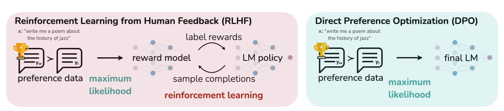
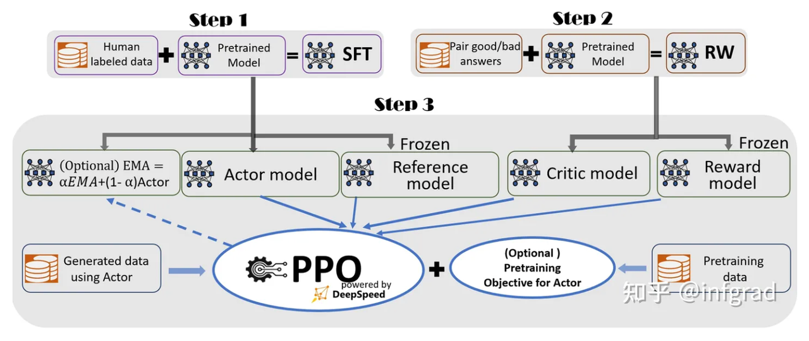

# 概述

## RLHF的两个假设
1. 成对的奖励偏好可以被单个奖励值替代。
核心思想：人类的偏好通常以成对比较的形式存在，但RLHF通过训练奖励模型的方式，将成对偏好转化为单个标量奖励值。
合理性：
    （1）通过标量奖励值，可以简化强化学习的目标，避免直接处理复杂的成对关系。
    （2）转化为通过回归任务学习人类偏好，理论上可以捕捉文本质量的相对排序。
局限性：
    （1）信息损失。成对比较可能包含更丰富的偏好信息（如“回答A在准确性上更优，但回答B更简洁”），但标量奖励值只能综合这些维度为单一分数，可能丢失细粒度偏好。
    （2）标度不一致 ：不同标注者的评分标准可能不一致，导致奖励值的绝对数值难以直接比较。

2. 奖励模型可以泛化到分布外的数据。
核心思想：奖励模型需在未见过的生成文本 （即分布外数据）上准确评估质量，否则强化学习可能无法有效优化策略。
挑战：
    （1）分布偏移。训练数据可能无法覆盖到所有场景，导致模型对分布外文本的评估不准确。
    （2）过拟合风向。奖励模型可能会过度依赖训练中的固定范式，导致无法泛化到多样化的结果。
改进方法：
    （1）数据增强。多样化的人类反馈数据。
    （2）正则化技术。KL散度约束，防止策略偏离原始语言模型太远。
    （3）动态更新。在训练过程中持续收集新反馈数据。

DPO虽然避免了这两个假设，然后DPO依然需要隐式假设偏好数据，说明人类反馈学习的核心挑战仍未完全解决。

## 当前LLM共识

1. 知识学习。在大规模语料上做预训练。
2. 知识表达。在指令数据上做微调，通过Lora等节省内存的方式，在此步骤中还是多多少少学习一些知识。
3. 偏好学习。让模型的输出更符合人类便好，此步骤重点在学习表达方式。

RLHF思想：使用强化学习的方式，直接优化带有人类偏好的语言模型。RLHF使得能够在一般数据语料库上训练的语言模型和复杂人类价值观对齐。

# 微调任务转化为RL问题

1. 策略：是一个接受并返回一系列文本（文本的概率分布）的LM。
2. 动作空间：LM词表对应的所有词元。
3. 观测空间：输入的元序列。

# reference

[Illustrating Reinforcement Learning from Human Feedback (RLHF)](https://huggingface.co/blog/rlhf)

[详解大模型RLHF过程（配代码解读）](https://zhuanlan.zhihu.com/p/624589622)

