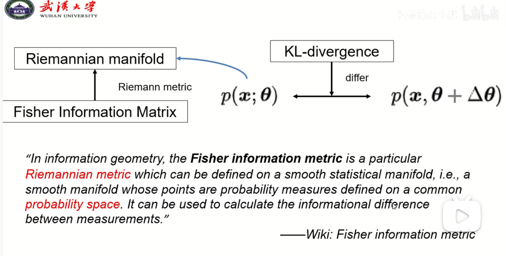
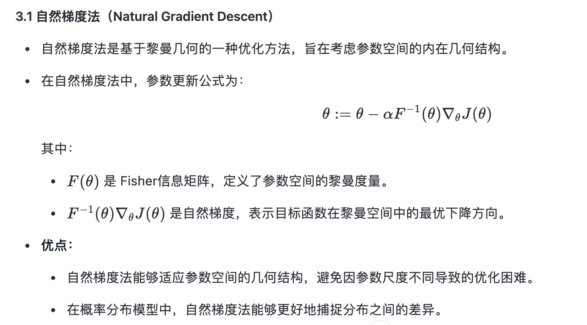

# 强化学习基础

1. 强化学习和监督学习的差别。
（1）

# TRPO 解决问题

- 解决步长太长问题。当策略网络是深度模型时，沿着策略梯度更新参数，有可能步长太长，导致策略变差。
- 策略变差又进一步导致采样数据变差，进入到恶性循环中。
- TRPO（Trust Region policy optimization），在理论上保持策略学习的性能单调性。

# 基本知识

## 欧式空间 & 黎曼空间

1. 在欧式空间中的梯度下降法公式为：
$\theta = \theta - \alpha \nabla_{\theta}J(\theta)$
参数 $\theta$被认为是欧式空间中的点，优化过程沿着负梯度方向更新参数。但其局限性表现在：
（1）对于概率模型，参数空间可能具有非线形约束（如概率分布的归一化条件），这使得欧式空间无法完全描述参数空间的几何结构。
（2）欧式空间建设所有参数方向的重要性都是相同的，但实际中，不同的参数可能对目标函数的影响不同。

2. 黎曼空间。在黎曼空间中，每个点都有一个局部的内积结构，用户定义角度和距离。在黎曼空间中，距离不依赖于两点的位置，而依赖于它们之间的路径及空间的曲率。

（1）在欧几里得空间中，两点之间的距离是直线距离，而在黎曼空间中，距离是沿着流形上的最短路径（测地线）计算的。
（2）黎曼空间考虑了参数空间的内在几何结构，能够更好地反映概率分布之间的关系。

Unified paradigm理论 for deepseek。
PRM方法。
ORM RL训练模型。
DAPO。

# 问题

1. NPG中kl散度为什么不能直接计算，而要用fisher矩阵估计呢
NPG的推导过程中由于限制目标函数在局部邻域内进行更新，因此可以对KL散度进行二阶泰勒近似，表示为Fisher矩阵的形式，最终得到的自然梯度为(F^-1)▽L(θ)，形式简洁直观。不使用Fisher做近似则没有利用邻域更新可以做近似这一优势，直接用KL散度求解约束优化问题，求解推导会很复杂，最终得到的更新式也不“优雅”，不利于计算更新。

2. 自然梯度法，里面的概率分布是哪里来的呀？是自己给定的吗
是说p(x;θ)吗，p(x;θ)就是要用自然梯度法来更新的包含未知参数的分布模型，在深度学习里一般就是一个神经网络，对应于RL里就是策略函数π，对应于分类问题就是对于输入x的输出类别的概率分布，应用自然梯度法来不断更新网络的未知参数尽量拟合真实分布。

3. 重要性采样存在的问题及改进。
（1）存在问题：
高方差：当新策略和老策略的差异较大时，会导致重要性权重会非常高或者非常低，导致估计值的方差会比较大。
不稳定：极端权重会导致训练不稳定。
（2）改进：
截断权重：限制极端权重的最大值和最小值。
使用优势函数：结合优势函数减少方差。
信任域优化：通过KL散度来限制新旧策略之间的差异，确保重要性采样的稳定性。

4. TRPO算法和PPO算法的区别是什么？
（1）都是对新策略和旧策略的进行约束，但TRPO是对KL散度小于一个值进行限制，在优化时使用了复杂的二阶优化（如共轭梯度和线搜索）算法；PPO将约束放在了目标函数内，即转化为正则化来限制新老策略之间的差异。因此，PPO算法提出了两种形式的目标函数：裁剪目标；惩罚目标。
（2）优化方法：
- TRPO：二阶优化
TRPO 使用二阶优化方法来解决约束优化问题，这包括：
近似目标函数 ：对目标函数进行二阶泰勒展开。
共轭梯度法 ：求解二次规划问题。
线搜索 ：确保更新后的策略满足 KL 散度约束。
这种方法虽然理论上能够精确控制策略更新，但计算复杂度较高，尤其是在高维参数空间中。

- PPO：一阶优化
PPO 使用一阶优化方法（如随机梯度下降或 Adam 优化器）来优化裁剪目标或惩罚目标。
由于目标函数的设计避免了显式的约束，PPO 的优化过程更加简单高效，计算成本也更低。

（3）计算复杂度
- TRPO：高复杂度
TRPO 的二阶优化方法需要计算 Hessian 矩阵的逆（或其近似值），这在高维参数空间中非常耗时。
此外，共轭梯度法和线搜索进一步增加了计算开销。

- PPO：低复杂度
PPO 的一阶优化方法只需计算梯度，无需涉及二阶导数或矩阵求逆。
因此，PPO 的计算效率更高，尤其适用于大规模深度强化学习任务。

5. 策略梯度算法的三个优化？
（1）增加基线。基本思想是增加reward大的动作出现的概率，减少reward小的动作出现的概率；以降低采样不均或者较好的数据采样不到的问题。
（2）增加折扣因子。
（3）优势函数。目的是解决每个eposide中所有的动作获得奖励都一样的问题。

6. PPO算法有啥缺陷
（1）

https://zhuanlan.zhihu.com/p/60257706
https://zhuanlan.zhihu.com/p/114866455
https://zhuanlan.zhihu.com/p/421545565
https://zhuanlan.zhihu.com/p/190045599
https://zhuanlan.zhihu.com/p/490373525

https://blog.csdn.net/sinat_52032317/article/details/134182730

https://blog.csdn.net/M3197783956/article/details/135026005

https://juejin.cn/post/7129708587105910814

[强化学习 | Policy Gradient | Natural PG 详细推导(1)](https://zhuanlan.zhihu.com/p/487754664)

[PPO(Proximal Policy Optimization)算法原理及实现](https://blog.csdn.net/weixin_41106546/article/details/137359690)

[PPO(Proximal Policy Optimization)近端策略优化算法](https://blog.csdn.net/qq_30615903/article/details/86308045)

[强化学习之PPO算法](https://zhuanlan.zhihu.com/p/468828804)

[Proximal Policy Optimization Algorithms](https://arxiv.org/pdf/1707.06347)

